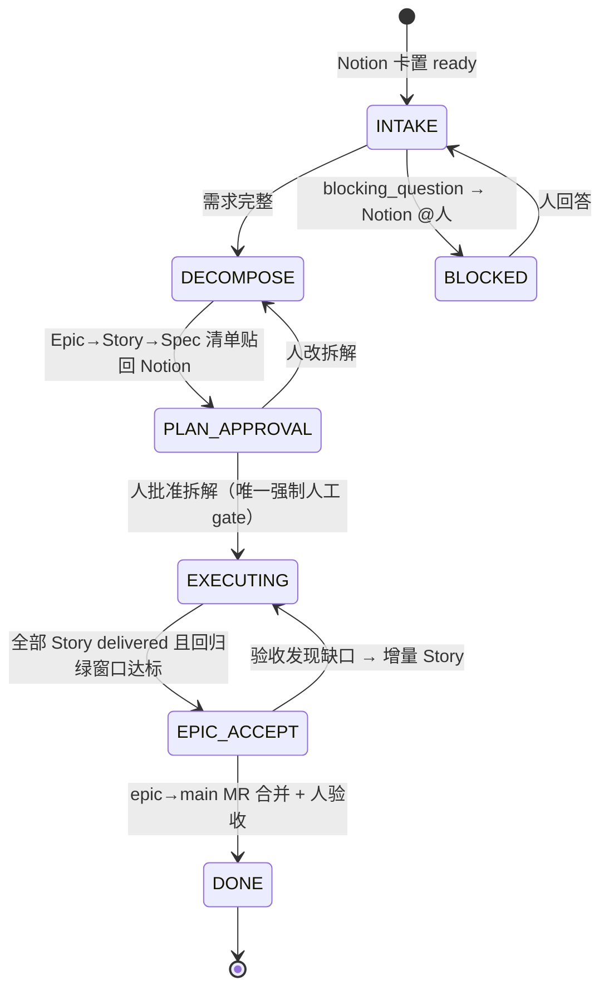
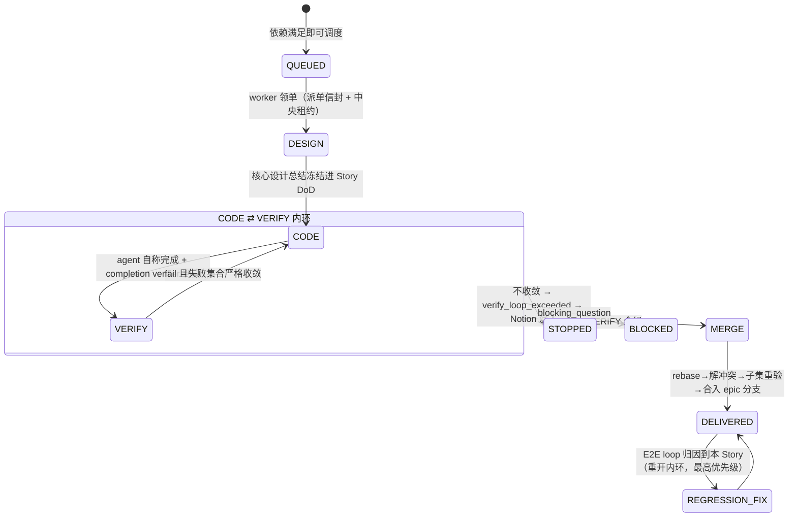

# 需求流水线与质量闭环设计

## 0. 设计原则（教训 → 硬约束映射）

| # | 教训来源 | 落成的设计约束 |
|---|---|---|
| 1 | busybee 旧验证阶梯硬编码 Maven 导致前端卡死循环 | 验证阶梯只定义**证据形态与裁决规则**，不定义命令；执行命令由 agent 现场决定，verdict 由代码从轨迹核验 |
| 2 | busybee 验证造假事故（file:// 假页面截图冒充 e2e） | 所有 agent 自报结论通道 = L2 物理掐断 + L3 代码校验双层；VERIFY/E2E runner 工具面禁写 |
| 3 | cumora builder/verifier 分离（DB CHECK 三层强制） | `VERIFY.session_id != CODE.session_id` DB CHECK；VERIFY 永远 fresh session 盲审 |
| 4 | cumora completion verifier | 每个 phase 出口一次独立小脑调用看 side effects，fail-closed |
| 5 | busybee 基线红绿（D7） | TDD 红证据从执行轨迹挖，挖不到 → skipped 升级 reviewer，不信自报 |
| 6 | cumora 失败物化 | regression 卡唯一索引去重；friction 计数器；24h 否决 ≥3 → 改进提案 |
| 7 | busybee "人为上限只伤真实工作" | 只兜 CODE⇄VERIFY 收敛性；真停点仅 blocking_question / verify_loop_exceeded |
| 8 | busybee memory 断流（D23） | 进料通道全部带流速指标 + 断流告警；调查报告/逐场景 verdict 强制入 memory |
| 9 | cumora 行为回归方法论 | 系统自测用样本级统计，不 gate PR |

## 1. 流水线 DAG

### 1.1 两层状态机

**Epic 级**（orchestrator 确定性状态机，权威真相在中央 DB，Notion 是投影）：



**Story 级**（EXECUTING 内部，每 Story 一个实例，多 worker 并行）：



**全局拓扑（含常驻 E2E loop）**：

```
                        ┌────────────────────────────────────────────┐
 Notion ──intake──► DECOMPOSE ──► [Story A]──┐                       │
   ▲                    │         [Story B]──┼─► MERGE ─► epic/<id> 集成分支
   │(每轮业务语言报告)   │         [Story C]──┘  (rebase+子集重验)    │ HEAD
   │                    │  依赖声明+footprint 决定并行/串行           ▼
   │              scenario 注册表 ◄──owner_story──┐   ┌─────────────────────┐
   │                                              └───┤ 常驻 E2E 回归 loop    │
   └── regression 卡(去重物化) ◄──统计判定+归因────────┤ 事件触发 + LRU 轮询    │
                                                      └─────────────────────┘
```

### 1.2 Story 并行判定：显式依赖声明为主、模块级 footprint 为辅的保守调度

DECOMPOSE 为每个 Story 产出：

- `depends_on: [storyId]`——语义依赖（B 要调 A 的接口），捕获"物理不冲突但逻辑有序"；
- `predicted_footprint: [模块/目录路径]`——**刻意目录/模块粒度，不用文件粒度**（agent 文件级预测实测不准，目录级足够保守可校准）。

调度规则（纯函数，可单测）：拓扑序内 footprint 两两不相交 → 并行分派；相交 → 串行链。另维护 **hotspot 文件清单**（路由表/i18n/schema 等历史冲突高发文件，资产化累积）——命中即强制串行。双信号取并集最安全，代价只是并行度略降——**正确性优先于吞吐**。

校准闭环：Story 合入后用实际 diff 回写 actual_footprint，预测偏差率进 memory 作为 DECOMPOSE 质量指标（进料通道带流速观测）。残余风险："不相交"的 Story 仍可能语义冲突——由合流后子集重验 + E2E loop 兜底。

### 1.3 分支与合流：epic 集成分支 + Story 分支逐个合入 + Epic 单 MR

- `epic/<id>` 从 main cut，是 Epic 的集成基准；每 Story 独立 worktree + `story/<epic>-<id>` 分支；**依赖 Story 在被依赖者合入后才 cut 分支**（天然拿到依赖代码，无需 cherry-pick）。
- 合流：rebase onto epic HEAD → 有冲突 CODE agent 现场解 → **子集重验**（本 Story 场景 + footprint 相交 Story 的场景）→ 合入。
- MR：Epic 级单 MR（epic→main），commit 按 Story 分段（保留 red/green），文案按 Story 分章；单 Story 小 Epic 退化为 story→main 直出。
- 理由：常驻 E2E loop 需要"当前 Epic 全量交付态"的分支作回归基准；人审拿到完整业务上下文；redo 语义清晰（每轮全新分支+新 MR 防 stale ref，busybee D6）。
- 缓解：epic 分支每日 merge main 防偏离（回归 loop 验证吸收成本）；>8 Story 的 Epic 提示"建议拆 Epic"由人裁决；人审主阵地是 Notion（每 Story 有设计总结+逐场景报告），MR 只是代码载体。

### 1.4 常驻 E2E 回归 loop：双池、非 gate、样本级判定

| 维度 | 设计 |
|---|---|
| 形态 | orchestrator 内 RegressionScheduler（确定性排程）+ 浏览器 worker 上的 regression runner（agent 会话，只读工具面） |
| 双池 | 活跃 epic 场景清单 → `epic/<id>` HEAD；已进 main 历史场景全集 → main HEAD（低频池） |
| 触发 | 事件：每次 Story 合入后该 epic 全量场景排一轮；空闲：LRU 轮询——最久未验证场景优先，永不停，让位前台任务 |
| 判定 | **样本级统计**：单次失败只标 suspect 并连排 N 次复测；窗口失败率超阈值才立卡（天然吸收 flaky） |
| 归因 | 场景注册表每条挂 owner_story；owner 已交付而失败出现在新合入之后 → 对**单个场景**在合入 commit 序列上二分 → 定位引入 Story |
| 物化 | regression 卡，唯一索引 `(scenario_id, failure_signature)` 去重 → 路由到归因 Story 的 REGRESSION_FIX，队列最高优先级 |
| 防伪 | runner 禁写代码（只能运行测试/驱动浏览器）；L2 拦 file:// 与非白名单 host；L3 verdict 校验 URL host 白名单 + 截图真实存在且 mtime 在本轮窗口 + 测试结果从执行轨迹取非自报 |

**VERIFY 与 E2E loop 职责边界**：

| | Story VERIFY（内环） | 常驻 E2E loop |
|---|---|---|
| 性质 | 出厂检验，**同步 gate** | 持续回归，**异步非 gate** |
| 范围 | 本 Story 场景 + 邻接受影响场景 | 全部已交付场景 |
| 失败后果 | 打回 CODE（收敛判据兜底） | 物化 regression 卡入队，不打断进行中内环 |
| 判据 | 单轮决定性 | 样本级统计 |

### 1.5 内环收敛判据

`failed_scenarios(N) ⊊ failed_scenarios(N-1)`（严格真子集）→ 放行续跑，不限轮次/时长/预算；持平、扩大或震荡 → verify_loop_exceeded → Notion @人并附收敛曲线。全系统只有两类真停点：`blocking_question` 和 `verify_loop_exceeded`。（"每轮修一个"拖长的钻空子风险：收敛曲线附在 Notion 卡供人随时叫停 + friction 事后反思。）

## 2. TDD 执行契约

### 2.1 Spec → 测试映射

DoD 每条业务场景带全局唯一 `scenario_id`（如 S-EPIC12-03）；测试代码内嵌标记（测试名前缀或注解 `@scenario S-EPIC12-03`）。**映射完整性由 L3 代码扫描核对**（扫测试文件收集标记 vs DoD 清单 diff），不信 agent 自报——缺口 → VERIFY 直接 fail 并列出未覆盖场景。

### 2.2 五层测试裁剪决策规则

DESIGN 阶段产出**测试矩阵声明**冻结进 Story DoD；VERIFY 按声明核对；豁免走 exempt + 理由留痕。

| 层 | 触发条件（按改动性质） | 证据形态 |
|---|---|---|
| 单测 | 永远（任何逻辑变更的底线层） | 轨迹中 test 工具事件：红输出 hash → 绿输出 |
| 集成 | 跨模块边界 / DB / 外部 IO / 消息 | 同上 + 真实依赖启动日志（禁 mock 冒充） |
| snapshot | API 响应形状 / 序列化输出 / 组件渲染树 | snapshot diff 文件落盘进 evidence |
| e2e | DoD 场景含用户可见行为流（业务场景基本都要） | 白名单 host 页面轨迹 + 截图（L3 校验真实性） |
| UI 测试 | 视觉/交互组件改动 | 截图对比 + 交互录制，进 evidence 目录 |

### 2.3 红绿证据链

CODE micro-cycle：按 scenario 逐条 `写测试 → 跑红 → 实现 → 转绿 → commit`，约定 `test(S-xx): red` / `feat(S-xx): green`——红绿在 **git 历史与执行轨迹双通道**可审计。verdict 代码从轨迹挖红证据（test 工具事件的失败名单）；挖不到红 → 该项 skipped 升级给盲审 reviewer（其 prompt 被要求专门审基线）。**验证命令永不硬编码**：契约只规定"必须留下红/绿的轨迹事件"，跑什么命令 agent 看现场决定。

## 3. 角色与模型分配表

档位映射见 02-distributed-execution §5（day1：大脑/中脑=Codex，小脑=GLM/Grok；预留 Claude 列 opus/sonnet/haiku）。

| 角色 | 职责边界 | 档位 | 升级条件 | 工具面 |
|---|---|---|---|---|
| 需求分析/拆解（DECOMPOSE） | Epic→Story→Spec 清单、依赖声明、footprint 预测 | **大脑** | —（拆解质量决定全局，恒大脑） | 读代码+读 Notion；无写 |
| Story 设计总结（DESIGN） | 核心设计一页纸 + 测试矩阵声明 | 中脑 | footprint 跨 ≥3 模块或 complexity=high → 大脑 | 读代码；无写 |
| 编码（CODE） | TDD micro-cycle、解合流冲突 | 中脑 | 内环第 2 次重启 → 大脑（最多升一次，再挂走 ops_alert） | 读写 worktree+测试+git（不可 push main） |
| 盲审验收（VERIFY） | fresh session 盲审、逐场景 verdict | 中脑 | inconclusive 或基线争议 → 大脑 | **只读**+测试+浏览器（L2 掐 file://、禁写） |
| completion verifier | 看 side effects 判 done 真伪，fail-closed | 小脑 | 永不升级（保持廉价快速） | 只读轨迹/diff，单次调用 |
| E2E 回归 runner | 执行场景、采证 | 中脑 | — | 只读+浏览器+测试；禁写代码 |
| 回归归因分析 | 失败签名、二分定位 | 中脑 | 归因矛盾/多 Story 疑凶 → 大脑 | 只读+git log/bisect |
| MR 文案 | 按 Story 分章的 MR 描述 | 小脑 | — | 只读 diff+DoD |
| 反馈 triage | Notion 评论分类路由 | 小脑 | — | 读 Notion+写路由决定（结构化输出） |
| 反思提案生成 | friction 累积 → prompt/规则/契约改进提案 | **大脑** | —（改系统自身规则是最高风险决策） | 只读 memory/轨迹；提案只落 Notion 待批 |
| memory distiller | 终局蒸馏 episode→lesson | 小脑 | — | 只读轨迹；写 memory 库 |

硬约束（代码级非 prompt 级）：`VERIFY.session_id != CODE.session_id` DB CHECK；VERIFY/E2E 工具面在 hook 层物理禁写与禁 file://。

## 4. 人类反馈闭环

```
Notion 评论/打回/needs_input 回答
        │ （反馈事件抢占调度队列头——人的输入是最高优先级）
        ▼
   triage（小脑，结构化四分类）
        ├─ requirement_change ─► 该 Story continue round（复用分支）或 DECOMPOSE 增量出新 Story
        ├─ defect ────────────► regression 卡（同一去重索引体系）
        ├─ process_feedback ──► friction 记录累加 ─► memory lesson candidate
        └─ answer ────────────► 解锁对应 BLOCKED 卡，回注同一上下文继续
```

**反思机制**：触发条件（任一）——同一角色 24h 被否 ≥3 次；同类 friction 累计 ≥N；行为回归统计显著劣化。触发后大脑生成**改进提案卡**（内容是具体 diff：prompt 措辞 / 调度规则参数 / 验证契约条款），贴 Notion 待人批准。批准后走 self-update 通道应用，并用行为回归统计验证新旧版本差异——**提案永远不自动生效，人批是唯一开关**。所有 triage 结果与提案采纳率带流速指标防断流。

## 5. 交付定义（DoD）契约

**Story DoD**（DESIGN 出口冻结，后续不漂移的 setpoint）：

```yaml
story_id: S-EPIC12-03
design_summary: <一页纸核心设计，业务语言>
scenarios:
  - id: S-EPIC12-03-a
    given/when/then: <业务语言>
    layers: [unit, e2e]          # 测试矩阵声明（§2.2 裁剪结果）
baseline: acceptance_test | bug_repro | exempt(reason)
acceptance_criteria: [<人可勾选的验收条目>]
predicted_footprint: [module/dir]
depends_on: [story_id]
```

**Epic 完成判定**（可代码判定，非 agent 自报）：全部 Story delivered ∧ epic 回归池连续 K 轮全绿（或 24h 无新增 regression 卡）∧ MR 合并 ∧ Notion 人工验收勾选。

**业务语言硬约束**：Notion 报告分两区——业务区（场景名 + 状态 + 一句人话结论）与折叠的 technical notes 区（命令/路径/栈）。**L3 lint 代码校验业务区**：出现代码块、文件路径、异常栈的 regex 命中即打回重写——可读性约束也不靠 prompt 自觉。

## 6. 系统自身的质量保障

| 层 | 对象 | 方法 |
|---|---|---|
| 单测 | 全部纯函数决策逻辑：收敛判据、footprint 相交判定、拓扑调度、triage 路由映射、regression 去重键、verdict→phase 映射、业务语言 lint | 常规单测，逻辑与 IO 分离（沿用 busybee parse/decision 纯函数模式） |
| 契约测试 | Notion client、PiRunner port | 罐头回放 adapter（busybee finalText 回放模式）；DoD schema 校验测试 |
| 行为回归 | prompt/规则变更后的 agent 行为 | **样本级统计**：每关键行为 N trials，比较通过率置信区间，nightly 报表，**不 gate PR**；prompt 改动前后 A/B 对照 |
| 闭环观测 | 防静默断流 | 指标见 04-observability §9.3；任一归零超窗即告警 |
