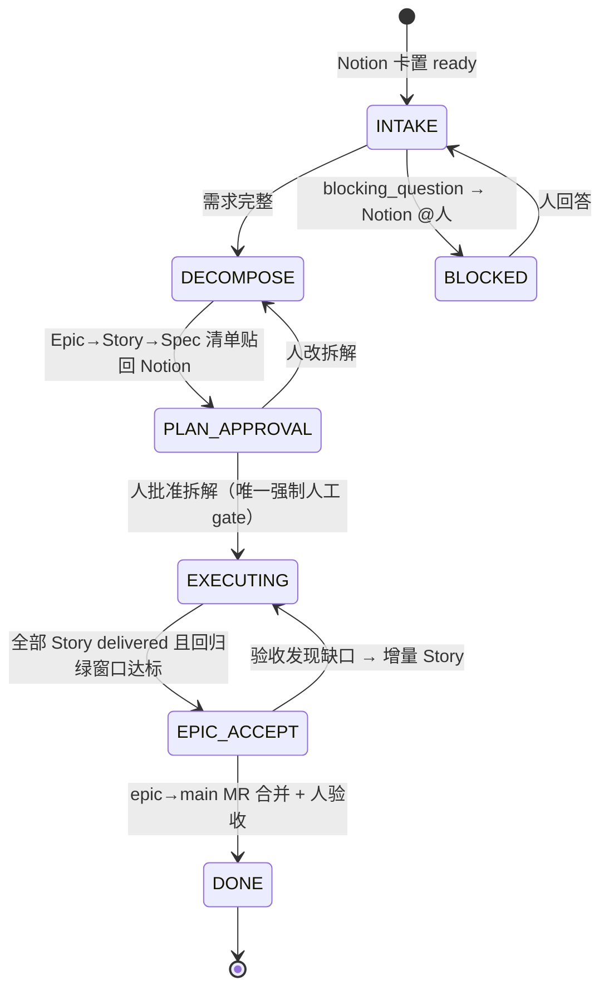
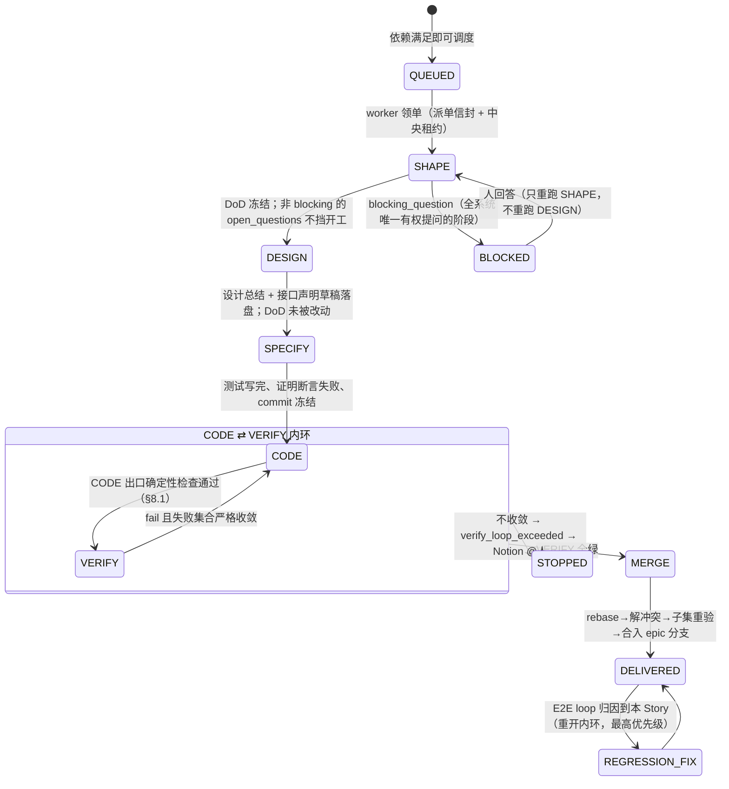
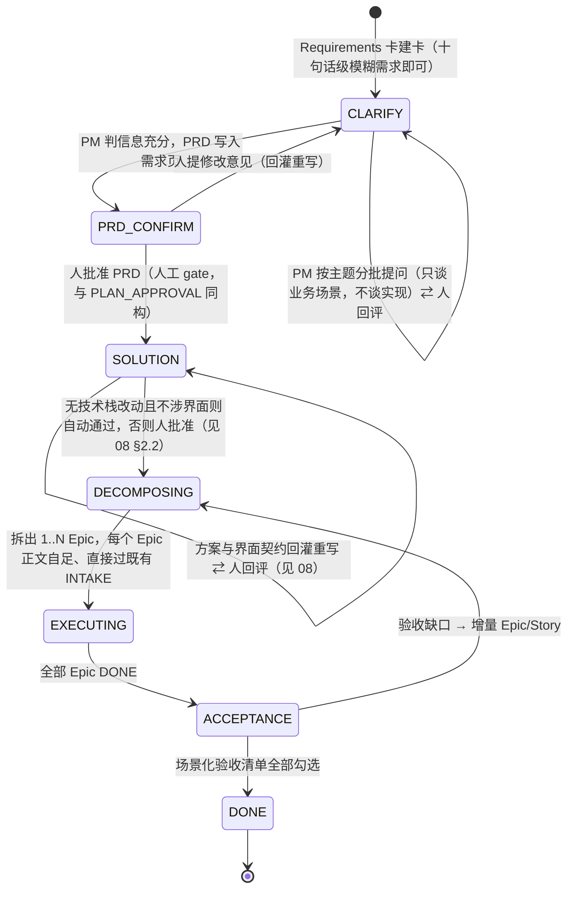

# 需求流水线与质量闭环设计

## 0. 设计原则（教训 → 硬约束映射）

| # | 教训来源 | 落成的设计约束 |
|---|---|---|
| 1 | busybee 旧验证阶梯硬编码 Maven 导致前端卡死循环 | 验证阶梯只定义**证据形态与裁决规则**，不定义命令；执行命令由 agent 现场决定，verdict 由代码从轨迹核验 |
| 2 | busybee 验证造假事故（file:// 假页面截图冒充 e2e） | 所有 agent 自报结论通道 = L2 物理掐断 + L3 代码校验双层。**掐断点是导航层的 `e2eHostAllowlist`（`guard/policy.ts:118`）与 verdict 层的屏幕证据校验（§9.2），不是工具面禁写**——伪造只需 navigate + screenshot，两个都是读操作，禁写从来挡不住它（2026-09-14 更正，见 07 §6） |
| 3 | cumora builder/verifier 分离（DB CHECK 三层强制） | `VERIFY.session_id != CODE.session_id` DB CHECK；VERIFY 永远 fresh session 盲审 |
| 4 | cumora completion verifier | ~~每个 phase 出口一次独立小脑调用看 side effects，fail-closed~~ **09-09 撤销**：内环只保留一个 LLM 判定（盲审），phase 出口改为确定性检查（§8.1）——一个会看走眼的裁判加在一个会看走眼的执行者后面，只是把不确定性乘了两次 |
| 5 | busybee 基线红绿（D7） | TDD 红证据从执行轨迹挖，挖不到 → skipped 升级 reviewer，不信自报 |
| 6 | cumora 失败物化 | regression 卡唯一索引去重；friction 计数器；24h 否决 ≥3 → 改进提案 |
| 7 | busybee "人为上限只伤真实工作" | 只兜 CODE⇄VERIFY 收敛性；真停点仅 blocking_question / verify_loop_exceeded |
| 8 | busybee memory 断流（D23） | 进料通道全部带流速指标 + 断流告警；调查报告/逐场景 verdict 强制入 memory |
| 9 | cumora 行为回归方法论 | 系统自测用样本级统计，不 gate PR |

## 1. 流水线 DAG

### 1.1 三层状态机（需求 / Epic / Story）

> 需求级见 §7.1（2026-09-01 增补）；本节描述 Epic 级与 Story 级。

**Epic 级**（orchestrator 确定性状态机，权威真相在中央 DB，Notion 是投影）：



**Story 级**（EXECUTING 内部，每 Story 一个实例，多 worker 并行）：



**全局拓扑（含常驻 E2E loop）**：

```
                        ┌────────────────────────────────────────────┐
 Notion ──intake──► DECOMPOSE ──► [Story A]──┐                       │
   ▲                    │         [Story B]──┼─► MERGE ─► epic/<id> 集成分支
   │(每轮业务语言报告)   │         [Story C]──┘  (rebase+子集重验)    │ HEAD
   │                    │  依赖声明+footprint 决定并行/串行           ▼
   │              scenario 注册表 ◄──owner_story──┐   ┌─────────────────────┐
   │                                              └───┤ 常驻 E2E 回归 loop    │
   └── regression 卡(去重物化) ◄──统计判定+归因────────┤ 事件触发 + LRU 轮询    │
                                                      └─────────────────────┘
```

### 1.2 Story 并行判定：显式依赖声明为主、模块级 footprint 为辅的保守调度

DECOMPOSE 为每个 Story 产出：

- `depends_on: [storyId]`——语义依赖（B 要调 A 的接口），捕获"物理不冲突但逻辑有序"；
- `predicted_footprint: [模块/目录路径]`——**刻意目录/模块粒度，不用文件粒度**（agent 文件级预测实测不准，目录级足够保守可校准）。

调度规则（纯函数，可单测）：拓扑序内 footprint 两两不相交 → 并行分派；相交 → 串行链。另维护 **hotspot 文件清单**（路由表/i18n/schema 等历史冲突高发文件，资产化累积）——命中即强制串行。双信号取并集最安全，代价只是并行度略降——**正确性优先于吞吐**。

校准闭环：Story 合入后用实际 diff 回写 actual_footprint，预测偏差率进 memory 作为 DECOMPOSE 质量指标（进料通道带流速观测）。残余风险："不相交"的 Story 仍可能语义冲突——由合流后子集重验 + E2E loop 兜底。

### 1.3 分支与合流：epic 集成分支 + Story 分支逐个合入 + Epic 单 MR

- `epic/<id>` 从 main cut，是 Epic 的集成基准；每 Story 独立 worktree + `story/<epic>-<id>` 分支；**依赖 Story 在被依赖者合入后才 cut 分支**（天然拿到依赖代码，无需 cherry-pick）。
- 合流：rebase onto epic HEAD → 有冲突 CODE agent 现场解 → **推 Story 分支并开 draft MR（story→epic）** → **子集重验**（本 Story 场景 + footprint 相交 Story 的场景）→ ff 合入 → 推 epic 分支。MR 必须在合入之前开：合入之后 epic 分支已含全部 commit，平台会以「无差异」拒绝；复验失败退回 CODE 后再来，复用已开的 MR，不开第二个；目标分支已包含该分支时不开 MR 并写明原因（2026-09-10）。
- epic 分支由系统在拆解批准时推到 origin，派发前重试，每次合入后推头；Story 分支 stack 在它上面，所以它不能只活在本机（2026-09-10）。
- MR：Epic 级单 MR（epic→main），commit 按 Story 分段（保留 red/green），文案按 Story 分章；单 Story 小 Epic 退化为 story→main 直出。
- 理由：常驻 E2E loop 需要"当前 Epic 全量交付态"的分支作回归基准；人审拿到完整业务上下文；redo 语义清晰（每轮全新分支+新 MR 防 stale ref，busybee D6）。
- 缓解：epic 分支每日 merge main 防偏离（回归 loop 验证吸收成本）；>8 Story 的 Epic 提示"建议拆 Epic"由人裁决；人审主阵地是 Notion（每 Story 有设计总结+逐场景报告），MR 只是代码载体。

### 1.4 常驻 E2E 回归 loop：双池、非 gate、样本级判定

| 维度 | 设计 |
|---|---|
| 形态 | orchestrator 内 RegressionScheduler（确定性排程）+ 浏览器 worker 上的 regression runner（agent 会话，只读工具面） |
| 双池 | 活跃 epic 场景清单 → `epic/<id>` HEAD；已进 main 历史场景全集 → main HEAD（低频池） |
| 触发 | 事件：每次 Story 合入后该 epic 全量场景排一轮；空闲：LRU 轮询——最久未验证场景优先，永不停，让位前台任务 |
| 判定 | **样本级统计**：单次失败只标 suspect 并连排 N 次复测；窗口失败率超阈值才立卡（天然吸收 flaky） |
| 归因 | 场景注册表每条挂 owner_story；owner 已交付而失败出现在新合入之后 → 对**单个场景**在合入 commit 序列上二分 → 定位引入 Story |
| 物化 | regression 卡，唯一索引 `(scenario_id, failure_signature)` 去重 → 路由到归因 Story 的 REGRESSION_FIX，队列最高优先级 |
| 防伪 | runner 禁写代码（只能运行测试/驱动浏览器）；L2 拦 file:// 与非白名单 host；L3 verdict 校验 URL host 白名单 + 截图真实存在且 mtime 在本轮窗口 + 测试结果从执行轨迹取非自报 |

**VERIFY 与 E2E loop 职责边界**：

| | Story VERIFY（内环） | 常驻 E2E loop |
|---|---|---|
| 性质 | 出厂检验，**同步 gate** | 持续回归，**异步非 gate** |
| 范围 | 本 Story 场景 + 邻接受影响场景 | 全部已交付场景 |
| 失败后果 | 打回 CODE（收敛判据兜底） | 物化 regression 卡入队，不打断进行中内环 |
| 判据 | 单轮决定性 | 样本级统计 |

### 1.5 内环收敛判据 + 可配置重试上限族（2026-08-25 修订）

两层兜底，先到先停：

1. **收敛判据（提前停）**：`failed_scenarios(N)` 不得等于此前任一轮的集合（回看窗口 `retry.oscillationLookback`）→ 放行续跑；与上一轮持平（stalled）或与更早一轮相同（oscillating）→ 立即 `verify_loop_exceeded`，不用等上限。
2. **可配置硬上限族（最终停）**——全部经 Web 控制台动态配置（05 文档 §4），默认值刻意宽松：

| 键 | 语义 | 默认 |
|---|---|---|
| maxInnerLoopRounds | CODE⇄VERIFY⇄MERGE 内环总轮次 | 3 |
| maxPhaseReentries | 单 phase 连续崩溃次数（failover/崩溃恢复/跨机重建合并计数），前进即清零 | 3 |
| maxContinueRetries | 断线 continue 重试 | 8 |
| maxRegressionReopens | 同一 Story 被 E2E loop 打回 REGRESSION_FIX 的次数 | 2 |
| maxInconclusiveRounds | 连续 inconclusive（跑不起来，§9.3）的容忍轮数，超出物化 friction | 2 |

**上限设在"离散重试轮次"，不设在单次运行的时长/token/预算上**——与 busybee 教训一致（后者只伤害真实工作，前者才是"系统在原地打转"的信号；busybee 自己也保留了 MAX_TEST_ITERS）。

**这一条约束的是"打转探测"，不是"花钱敞口"（2026-09-10 增补）。** 两者是不同的控制，互为劣质代理：轮次答的是"系统是否在原地打转"，预算答不了；费用答的是"一张卡最多可以花多少钱才该有人看一眼"，轮次同样答不了——同样 6 轮内环，在 1M 上下文模型上的花费能差一个数量级。所以新增第三层，与上两层职责分离、先到先停：

3. **单卡费用上限（花钱敞口）**：`cost.perCardUsdCeiling`（默认 5 USD，约 35 元；单位是 USD 因为 pi 就按 USD 报价）。在 **phase 边界**检查——一次 turn 无法中途掐断，且"即将开始那一轮花多少"在它结束前不可知，所以上限是**超支的下界，不是精确切口**：卡是"越线之后停"，不是"越线之前停"。**订阅额度不计入**：包月计划无论卡用不用都是同一笔钱，把 pi 给订阅算的名义价折进去，会为一笔没发生的支出提前停牌一张卡。

到达费用上限的处置与上限族不同：**不出诊断报告，也不进反思管道**。费用停点对"这活能不能干成"零信息量，报告只说花了多少、花在哪个 phase、以及"这是花钱上限不是对工作的判决，抬上限继续或把卡拆小"。混淆这两件事会让读卡的人去查一个不存在的需求缺陷。

**到达上限的处置**：卡置失败 + Notion @创建人 + **诊断报告**（中脑基于收敛曲线、失败集合演化、轮次证据生成业务语言说明），按两分法给出结论与建议：

- **需求侧**：需求太难或拆解粒度不合理 → 建议人工拆卡、补充上下文或调整 Spec；
- **系统侧**：中间流程/逻辑存在缺陷（如验证契约歧义、prompt 误导、调度错误）→ 自动物化 friction 进反思提案管道（§4），累积后产出流程优化提案。

**停点汇总落库 + 停点钩子（2026-09-17）。** 跨轮诊断（`diagnoseRetryLimit` / `renderConvergenceReport`）此前只进带外告警或 `console.log`，从不落库，于是人在卡上只看到「重试次数用完」一个词。改为：`stopForInput` 在停卡的同一批事务里汇总「人最后一次动卡之后」的全部经过——逐轮没过的场景与理由、归因到本卡的合流打回、Epic 头自身红、出口拒绝、崩溃次数与类别、花费、诊断——写入 `stories.stop_summary` 并随 `story.stopped` 事件一同留存，人恢复卡后不再展示（陈旧的汇总会被读成当前状态）。分发经 `StoryStopSink`：告警 sink 与 friction sink（`story_stopped`，费用停不进——§1.5），后者即反思管道（§4）的输入。Story 页四类停点**都**附汇总，不再只有 `verify_loop_exceeded`。

全系统真停点因此为四类：`blocking_question`、`verify_loop_exceeded`（不收敛提前停）、`retry_limit_exceeded`（上限停 + 诊断）、`cost_ceiling_exceeded`（费用停，无诊断）。四者由 `stories.stop_reason` 的 CHECK 强制。

#### 2026-09-17 修订：判据放宽为"不得重复"，轮次预算收紧为 3

严格真子集在实测里停错了卡：S-AGENTRULES-01 第 2 轮修好三个场景、冒出一个新的，被判 `expanded` 当场停下，6 轮预算只用掉 2 轮。真实的修改经常是"换一个失败"而不是"少一个失败"，这类轮次是进展而不是打转。因此：

- 判据只保留 **stalled**（与上一轮相同）与 **oscillating**（与回看窗口内更早一轮相同）两种提前停；**expanded 不再停**，照常消耗一轮继续。判据的真正内容是「下一轮不会是已经跑过的那一轮」。
- 兜底因此从判据回到轮次预算，预算收紧为 **3**：三轮是一张正常 Story 走完内环所需；要更多轮说明下一轮也解决不了。
- **CODE⇄VERIFY⇄MERGE 视为同一内环**。VERIFY 拒绝消耗一轮；合流复验失败且归因到本 Story（冲突、或集成树上本 Story 新引入的失败）同样消耗一轮（§8.3）。崩溃、只因环境判不出结论的验证、以及 Epic 头自身已红的复验都不消耗。
- 两个停点分工：**重复** → `verify_loop_exceeded`（再给轮次也无用，要改的是做法、测试或验收标准）；**预算耗尽但集合仍在变** → `retry_limit_exceeded`（附 `convergence: budget_exhausted`，抬高 `retry.maxInnerLoopRounds` 或人接手都是真选项）。两者同真时以重复为准。
- `maxPhaseReentries` 不再是内环的一部分，只做崩溃安全网：单 phase 连续崩溃计数，卡一旦系统性前进即清零（§1.5 之外的记账见 orchestrator 派发失败入账）。

**停点详情必须带收敛分类（2026-09-14）。** `src/pipeline/convergence.ts:37` 早已算出 `stalled` / `oscillating` / `expanded` 三种分类，但 `story-worker.ts:351` 把它们连同"轮次烧满"一起塌缩成同一个 `verify_loop_exceeded`，人看到"验证循环超限"看不出"第 2 轮就原地打转"。停点**类别不变**（仍是四类，不违反 CHECK），但详情里如实写出分类。**"重复几轮算停滞"不参数化**（2026-09-14 复审撤回原方案，2026-09-17 仍成立）：持平即停就是「两轮完全一样就是缺陷，不等」。把它提成 `stagnantRoundsBeforeStop` 只有两个结果——取 1 等于现状（配置没有作用），取 >1 等于允许把一轮原样再跑一遍。持平与震荡本是同一条规则的两个窗口，所以只保留 `oscillationLookback` 一个配置项，它等于「回看多少轮找相同集合」。

真正的「停止条件可快速迭代」不靠阈值，靠 04 §5.5 的 invariant 层——新判据是数据不是主流程里的 if 分支，改一条不发版，违反只产生 finding 不阻断。**续跑规则本身是不变量，不参与迭代。** 同理，**不新增任何"为什么没进展"的判断逻辑**：停点交给人，人用 §12 的 `rework` 通道决定是否解冻。（"每轮修一个"拖长的钻空子风险：收敛曲线附在 Notion 卡供人随时叫停 + 上限族最终兜底。）

## 2. TDD 执行契约

> **2026-09-14 结构变更**：TDD 从"CODE 内部的 micro-cycle"提升为跨阶段的脊柱。测试的编写、证红与冻结移到独立的 SPECIFY 阶段（§12.2），CODE 只负责让冻结的测试转绿。本节 §2.3 描述的红绿证据链因此从"同一个 agent 自证时序"变成"两个阶段之间的物理时序"。

### 2.1 Spec → 测试映射

DoD 每条业务场景带全局唯一 `scenario_id`（如 S-EPIC12-03）；测试代码内嵌标记（测试名前缀或注解 `@scenario S-EPIC12-03`）。**映射完整性由 L3 代码扫描核对**（扫测试文件收集标记 vs DoD 清单 diff），不信 agent 自报——缺口 → VERIFY 直接 fail 并列出未覆盖场景。

### 2.2 五层测试裁剪决策规则

DESIGN 阶段产出**测试矩阵声明**冻结进 Story DoD；VERIFY 按声明核对；豁免走 exempt + 理由留痕。

**层有归属，且由系统固定而非 DoD 声明（2026-09-10）**：unit / integration / snapshot 归 CODE，用测试证明；e2e / ui 归 VERIFY，在真实浏览器里证明。CODE 是 TDD 驱动、要快，不买慢的浏览器轮；VERIFY 不采信 CODE 对屏幕的自述。CODE 出口只查 CODE 归属层的红绿证据；VERIFY 对每个 e2e / ui 场景要求**属于该场景独有的截图 + 到达的页面**，由 verdict 代码校验——S-E3OVERVIEW-01 曾用同一张截图通过四个场景。缺失记 `inconclusive`（§9.3），不进 failed 集合。

| 层 | 触发条件（按改动性质） | 证据形态 |
|---|---|---|
| 单测 | 永远（任何逻辑变更的底线层） | 轨迹中 test 工具事件：红输出 hash → 绿输出 |
| 集成 | 跨模块边界 / DB / 外部 IO / 消息 | 同上 + 真实依赖启动日志（禁 mock 冒充） |
| snapshot | API 响应形状 / 序列化输出 / 组件渲染树 | snapshot diff 文件落盘进 evidence |
| e2e | DoD 场景含用户可见行为流（业务场景基本都要） | 白名单 host 页面轨迹 + 截图（L3 校验真实性） |
| UI 测试 | 视觉/交互组件改动 | 截图对比 + 交互录制，进 evidence 目录 |

### 2.3 红绿证据链

CODE micro-cycle：按 scenario 逐条 `写测试 → 跑红 → 实现 → 转绿 → commit`，约定 `test(S-xx): red` / `feat(S-xx): green`——红绿在 **git 历史与执行轨迹双通道**可审计。verdict 代码从轨迹挖红证据（test 工具事件的失败名单）；挖不到红 → 该项 skipped 升级给盲审 reviewer（其 prompt 被要求专门审基线）。**验证命令永不硬编码**：契约只规定"必须留下红/绿的轨迹事件"，跑什么命令 agent 看现场决定。

## 3. 角色与模型分配表

档位映射见 02-distributed-execution §5（day1：大脑/中脑=Codex，小脑=GLM/Grok；预留 Claude 列 opus/sonnet/haiku）。

| 角色 | 职责边界 | 档位 | 升级条件 | 工具面 |
|---|---|---|---|---|
| 需求分析/拆解（DECOMPOSE） | Epic→Story→Spec 清单、依赖声明、footprint 预测 | **大脑** | —（拆解质量决定全局，恒大脑） | 统一工具集；prompt 约束不写代码 |
| 需求硬化与消歧（SHAPE） | DoD（冻结）+ open_questions；全系统唯一有权提问的阶段 | **大脑** | —（它定的是整张卡的验收基准） | 统一工具集；prompt 约束只写文档产物 |
| Story 设计总结（DESIGN） | 核心设计一页纸 + 接口声明草稿；**禁止提问** | 中脑 | footprint 跨 ≥3 模块或 complexity=high → 大脑 | 统一工具集；prompt 约束写声明不写实现 |
| 测试契约（SPECIFY） | test-contract + 测试代码，证明断言失败并 commit 冻结 | **大脑** | — | 统一工具集；出口 tree-pin 把非测试改动 revert |
| 编码（CODE） | TDD micro-cycle、解合流冲突 | 中脑 | 内环第 2 次重启 → 大脑（最多升一次，再挂走 ops_alert） | 读写 worktree+测试+git（不可 push main） |
| 盲审验收（VERIFY） | fresh session 盲审、逐场景 verdict | 中脑 | inconclusive 或基线争议 → 大脑 | **只读**+测试+浏览器（L2 掐 file://、禁写） |
| UI 验收走查（VERIFY 内独立道） | 产品经理视角逐场景验收界面 + 出界面 findings（不否决） | **大脑** | —（判"是否是当初要的东西"，恒大脑；需目录宣告图片输入） | **只读**+浏览器+截图作图片输入；无写 |
| E2E 回归 runner | 执行场景、采证 | 中脑 | — | 只读+浏览器+测试；禁写代码 |
| 回归归因分析 | 失败签名、二分定位 | 中脑 | 归因矛盾/多 Story 疑凶 → 大脑 | 只读+git log/bisect |
| MR 文案 | 按 Story 分章的 MR 描述 | 小脑 | — | 只读 diff+DoD |
| 反馈 triage | Notion 评论分类路由 | 小脑 | — | 读 Notion+写路由决定（结构化输出） |
| 反思提案生成 | friction 累积 → prompt/规则/契约改进提案 | **大脑** | —（改系统自身规则是最高风险决策） | 只读 memory/轨迹；提案只落 Notion 待批 |
| memory distiller | 终局蒸馏 episode→lesson | 小脑 | — | 只读轨迹；写 memory 库 |

**"工具面"一列在 2026-09-14 变了含义**：取消 per-phase 工具面限制后工具集全阶段统一，阶段差异由 prompt 尾部约束 + 确定性出口判据承担。理由见 07 §6——工具面禁写挡不住它声称要挡的事故，而它每切一刀就废掉一段缓存前缀。

硬约束（代码级非 prompt 级，且都不改工具 schema）：`VERIFY.session_id != CODE.session_id` DB CHECK（`0001_init.sql:510`）+ 运行时复检（`verify/executor.ts:343`）；`e2eHostAllowlist` 在导航层禁 file://（`guard/policy.ts:118`）；`fencedPatterns` 在 hook 层禁改 SPECIFY 冻结的测试。

## 4. 人类反馈闭环

```
Notion 评论/打回/needs_input 回答
        │ （反馈事件抢占调度队列头——人的输入是最高优先级）
        ▼
   triage（小脑，结构化四分类）
        ├─ requirement_change ─► 该 Story continue round（复用分支）或 DECOMPOSE 增量出新 Story
        ├─ defect ────────────► regression 卡（同一去重索引体系）
        ├─ process_feedback ──► friction 记录累加 ─► memory lesson candidate
        └─ answer ────────────► 解锁对应 BLOCKED 卡，回注同一上下文继续
```

**反思机制**：触发条件（任一）——同一角色 24h 被否 ≥3 次；同类 friction 累计 ≥N；行为回归统计显著劣化；`retry_limit_exceeded` 诊断判为系统侧（§1.5）。触发后大脑生成**改进提案卡**（内容是具体 diff：prompt 措辞 / 调度规则参数 / 验证契约条款），贴 Notion 待人批准（可见性与讨论）。**批准后不直接改文件**：prompt 类提案自动生成 Prompt 工作台的 draft 版本，走"灰度 → 行为回归对比 → 发布/回滚"流程（05 文档 §6）；配置类提案落 config draft（05 文档 §4）。**提案永远不自动生效，人批是唯一开关**。所有 triage 结果与提案采纳率带流速指标防断流。

## 5. 交付定义（DoD）契约

**Story DoD**（**SHAPE 出口冻结**，后续不漂移的 setpoint；2026-09-14 起产出方从 DESIGN 改为 SHAPE，理由见 §12.5。`design_summary` 随之移出 DoD，成为 DESIGN 自己的 `design-summary` 产物）：

```yaml
story_id: S-EPIC12-03
dod_version: <整卡验收契约的内容 hash；覆盖范围与归一化规则见本节末>
scenarios:
  - id: S-EPIC12-03-a
    given/when/then: <业务语言；then 点名可观察物与边界>
    scenario_version: <该条自己的 hash；§12.5 的逐条失效判据读它，由系统算出，作者不写>
    layers: [unit, e2e]          # 测试矩阵声明（§2.2 裁剪结果；层归属由系统固定）
    source: <含 e2e/ui 层时必填：数据从哪张表、哪类事件、哪个既有接口来>
    seed: <可选：given 在屏幕上需要的样例数据，人话一句；走查前经仓库的 verify.seedCommand 造出>
    examples:                    # 含 e2e/ui 层时必填：至少一条 shows 与一条 excludes
      - kind: shows
        text: <用户看到的字面文本>
      - kind: excludes
        text: <不得出现的内容>
baseline: acceptance_test | bug_repro | exempt(reason)
acceptance_criteria:             # 每条必须有归宿
  - text: <人可勾选的验收条目>
    scenarios: [S-EPIC12-03-a]   # 由这些场景的测试证明
  - text: <约束型条目>
    constraint: <由什么代码检查兜底>
out_of_scope: [<走查不得据以否决的事项；可为空但必须写>]
relies_on: [<依赖其正常工作的既有页面/路由/服务；它们坏了不算本卡失败>]
predicted_footprint: [module/dir]
depends_on: [story_id]
```

**`dod_version` 覆盖什么（2026-09-14 二次复审修正）。** 初稿写的是「scenarios 的 id / given / when / then / layers / examples」，漏掉了两类同样决定"做成什么算对"的字段，会产生**漏失效**——比 hash 抖动严重得多的方向：

| 进 hash | 为什么 |
|---|---|
| `scenarios[].id / given / when / then / layers` | 验收语义本体 |
| `scenarios[].source` | **初稿漏了**。把数据来源从"模拟数据"改成"真实事件表"，其余字段一字不动，实现要重写而 hash 不变，下游会整套复用旧产物 |
| `scenarios[].seed` | **初稿漏了**。走查前由 `verify.seedCommand` 逐字喂进去，改 seed 就是改了走查看到的那块屏幕 |
| `scenarios[].examples[].kind / text` | 字面样例正是"简洁""清晰"这类词的定义 |
| `acceptance_criteria[].text` 与它的 `scenarios[]` / `constraint` 归宿 | 验收条目与场景的映射改了，同一组场景全绿也不再等于这张卡做完了 |
| `baseline`（含 `exempt` 的 reason） | 它决定这张卡是否需要一条红测试 |
| `out_of_scope` / `relies_on` | 走查能否据以否决、哪些失败不算本卡的，都是验收边界 |

不进 hash：`design_summary`（已移出 DoD）、`predicted_footprint`、`depends_on`（调度信息，不是验收基准）、`open_questions` 的开闭状态。

**两个层级的版本，各管一件事（2026-09-14 三次复审补齐）。** 只有整卡一个 `dod_version` 是不够用的：改一条 scenario 就会让整卡版本变，于是"未受影响的 scenario 保留结论"与"结论必须带当前版本"直接打架（§12.5 展开）。所以定义两个：

| 版本 | 覆盖 | 用途 |
|---|---|---|
| `dod_version` | 上表全部字段 | 契约身份：这份 DoD 是哪一版，记在每条产物与结论上 |
| `scenarios[].scenario_version` | **该 scenario 自己的字段** + **对它生效的全局字段**（`baseline`、`out_of_scope`、`relies_on`，以及 `acceptance_criteria` 里引用了它的那些条目的 `text` 与归宿） | 失效判据：这一条的验收基准变没变 |

两者用同一套归一化与同一个 hash 函数，区别只在喂进去的字段集合。这样"受影响"就是可计算的，不再是一个需要人判断的词：**`scenario_version` 变了的就是受影响的**。改一个全局字段会让所有 scenario 的版本一起变，这是对的——`out_of_scope` 变了，每一条走查结论的边界都变了。

**归一化只做结构规范化，不碰文本内容**（2026-09-14 三次复审收紧）：Unicode NFC → 集合类数组按稳定键排序（scenarios 按 id、examples 按 (kind, text)、criteria 按 text、`layers` / `out_of_scope` / `relies_on` 等字符串数组按码点序）→ 对象键按码点序的规范 JSON 序列化 → SHA-256。

**不再做"去首尾空白 + 内部连续空白折成单空格"**。初稿那一步会漏掉真实的验收变化：`examples[].text` 定义的正是用户在屏幕上看到的**字面**内容，`seed` 是逐字喂给 `verify.seedCommand` 的造数输入，两者的换行、缩进、连续空格都可能是有意义的；折叠之后改了它们 hash 却不变，而这正是本节刚刚宣布要避免的漏失效方向。首尾空白无须归一化器处理——`dod.ts` 的 schema 已在 `z.string().trim()` 层面削掉，进 hash 的文本本来就没有首尾空白；内部空白一律原样保留。

因此**撤回"改措辞不改验收语义时 hash 不变"这条判据**（2026-09-14）：普通 hash 做不到语义等价判断，写成验收判据等于要求一个不存在的实现。真实性质是单向的——**覆盖字段里任何一个字符变了（空白也算），hash 必变**；唯一被吸收的差异是集合元素的书写顺序与 JSON 的键序，那两者确实不携带验收语义。失效方向因此是保守的：可能因为改个错别字或多敲一个空格而多作废一次下游产物，**不会漏掉一次真正的验收变更**。多作废的代价是重跑，漏作废的代价是对着旧需求交付。

**DoD 写到什么程度（2026-09-10）**：只读代码的 CODE 与只看屏幕的走查，对着同一条 `then` 必须得出同一个结论。「简洁」「清晰」「摘要」这类词必须由 `examples` 的字面样例定义；schema（`src/pipeline/dod.ts`）在 **SHAPE** 出口强制上述字段，含糊的 DoD 出不了 SHAPE。依据：S-E3OVERVIEW-01 八轮中两轮（第 6、7 轮）源于 `then` 只写「简洁活动摘要」，CODE 按最小解释做、走查按用户语义打回，两边都没错，错在 DoD 允许两种解释；另有三条验收标准无任何场景归宿，只能靠评审人眼发现。

**Epic 完成判定**（可代码判定，非 agent 自报）：全部 Story delivered ∧ epic 回归池连续 K 轮全绿（或 24h 无新增 regression 卡）∧ MR 合并 ∧ Notion 人工验收勾选。

**业务语言硬约束**：Notion 报告分两区——业务区（场景名 + 状态 + 一句人话结论）与折叠的 technical notes 区（命令/路径/栈）。**L3 lint 代码校验业务区**：出现代码块、文件路径、异常栈的 regex 命中即打回重写——可读性约束也不靠 prompt 自觉。

## 6. 系统自身的质量保障

| 层 | 对象 | 方法 |
|---|---|---|
| 单测 | 全部纯函数决策逻辑：收敛判据、footprint 相交判定、拓扑调度、triage 路由映射、regression 去重键、verdict→phase 映射、业务语言 lint | 常规单测，逻辑与 IO 分离（沿用 busybee parse/decision 纯函数模式） |
| 契约测试 | Notion client、PiRunner port | 罐头回放 adapter（busybee finalText 回放模式）；DoD schema 校验测试 |
| 行为回归 | prompt/规则变更后的 agent 行为 | **样本级统计**：每关键行为 N trials，比较通过率置信区间，nightly 报表，**不 gate PR**；prompt 改动前后 A/B 对照 |
| 闭环观测 | 防静默断流 | 指标见 04-observability §9.3；任一归零超窗即告警 |

## 7. 增补（2026-09-01）：需求层（产品经理）状态机与场景化验收

> 决策见 00-overview §2「产品经理层」；Notion 侧信息架构见 01 §8。在 §1.1 的 Epic 级之上增加 Requirement 级状态机；PM 是新角色（大脑档），是用户唯一的业务对话面。

### 7.1 Requirement 级状态机



### 7.2 原则（继承既有不变量，不新增例外）

- **不新增真停点类别**：澄清等待人回答复用 blocking_question 语义（needs_input 呈现）；PRD 确认与验收勾选是状态机人工 gate（同 PLAN_APPROVAL），不是停点。澄清轮次上限 config 化，超限 → blocking_question @人。
- **业务语言约束扩展**：PM 的提问与 PRD 全文适用业务语言 lint（不得含实现词汇）。用户在需求层只谈方向与场景；实现细节问题只允许在 Story 层以 blocking_question 出现且应少量。
- **字段所有权不变**：原始需求区段人 owner；澄清记录/PRD/验收清单系统 owner，人的勾选与评论作为输入被 ingest——同一字段仍永不双向合并。
- **验收关注行为不关注代码**：验收清单逐条对应 PRD 场景（业务语言）；代码质量由既有自动化（盲审/确定性出口检查/回归 loop）+ 定期优化单（tasks.md M4-18）管控，不进入人的验收面。
- **Epic 完成判定的归属（2026-09-02 补记）**：§1.1 的 `EPIC_ACCEPT → DONE : MR 合并 + 人验收` 中，「人验收」对隶属需求的 Epic 上移到需求层——MR 合并（`EpicCompletion` 经平台 CLI 读回 merged 状态，代码判定）即 DONE，人的验收只在需求页按场景勾选做一次；独立 Epic（无 requirement）仍需人在看板拖到「已完成」+ MR 合并两者齐备。此前无任何代码执行该迁移，需求永远到不了 ACCEPTANCE。

### 7.3 角色与模型分配表扩展（§3 增补行）

| 角色 | 档位 | 说明 |
|---|---|---|
| PM（澄清/PRD/需求拆解/验收清单生成） | 大脑 | 面向用户的唯一业务对话面；prompt 独立于开发线（prompts/pm/），经 resolveModel 取模型 |

## 8. 增补（2026-09-09）：主流程收敛——内环只保留一个 LLM 判定

依据 2026-09-05 首次 Epic→Story 实跑的数据（三张 Story、约 45 条 phase.failed，其中供应商类约 31 条，无一交付）与 `docs/design/diagrams/story-main-flow-as-built.html` 的断点分析。核心结论：一轮内环串着 CODE agent、CODE completion judge、VERIFY agent、MERGE agent、MERGE completion judge 五个 fail-closed 的 LLM 判定，合流再加一个盲审；每个否决都按"代码有问题"计入预算，供应商故障再吃一次预算。这是"小任务跑不完"的结构性原因，不是某个 bug。

### 8.1 CODE 出口改为确定性检查，撤销 completion judge

§0 第 4 条引入 completion judge 的目的是抓"自称完成但没做"。它要抓的三种形态全部有确定性替代，且 §2.1 / §2.3 早已把原料定义成了契约：

| 假完成形态 | 代码检查（CODE 出口，fail-closed） |
|---|---|
| 树脏、没提交 | `git status --porcelain` 为空；`main..HEAD` 有提交 |
| 红绿没跑 | 规范日志里每个 scenario_id 至少一次失败的 test 事件后接一次成功的 test 事件（§2.3 双通道之一） |
| 场景没测 | 扫测试文件收集 `@scenario` 标记与 DoD diff（§2.1，此前未实现） |
| 不可合并 | format / lint / typecheck / 全量测试通过；`git diff --check` 干净 |

不过检查项**不计任何预算、不产生停点**，清单原样喂回 CODE 继续。确定性覆盖不到的只剩"实现是否真的满足需求"，那是 VERIFY 的职责；CODE judge 与 VERIFY 重叠，撤销。MERGE 的 completion judge 同样撤销：它要确认的"没越权合并、报告存在"分别由工具面掐断与 artifact 存在性检查覆盖。

### 8.2 MERGE 只写报告，没有否决权

MERGE 阶段保留为"写业务语言交付报告"，报告质量由 §5 的业务区 regex lint 校验。MERGE 不再跑任何门禁；门禁全部前移到 8.1 的 CODE 出口，并在合流时由系统再跑一次。此前 `git diff --check` 是 agent 在只读阶段自选执行、失败后无处修复，导致六次原地停点。

### 8.3 合流复验改为确定性测试，浏览器盲审归回归 loop

§1.3 子集复验的目的是抓"单独对、叠在一起错"。实跑证实这是真需求（三个 Epic 的 Story 都改同一页面与路由表），但 §1.4 的常驻回归 loop 本就负责这件事。修订：rebase 到 Epic 头后，只运行本 Story 与 footprint 相交 Story 在 CODE 阶段写下的全部测试（含 e2e 脚本），通过即 ff-merge；浏览器盲审只在 Story 首轮 VERIFY 做一次，合入后由回归 loop 异步扫，失败开 regression 卡而不是把 Story 打回 CODE。合流从 gate 变成确定性步骤，成本接近零。

**检查跑在 rebase 之后的 Story 树上，失败要先归因（2026-09-17 修订）。** 此前复验在**集成 worktree** 里跑，而那棵树在 ff-merge 之前恰恰是**不含本 Story 的 Epic 头**：S-AGENTRULES-01 因此被一条与它无关的 `catalog-snapshot > deepseek` 打回两轮，两次失败载荷逐字节相同——Story 怎么改都改不了结果。修订三条：

1. **树**：候选 = rebase 后的 Story worktree（即将被 ff 的那棵），基线 = 集成 worktree（此刻的 Epic 头）。复验前后两个 HEAD 都不得移动，否则拒绝合入。
2. **相关性**：与 CODE 出口共用 `selectProjectChecks`，按 `when` glob 对 `git diff --name-only base candidate` 的结果筛选；全部不相关即通过。
3. **归因**：候选失败的检查**只有此时**才在基线上再跑一次，得三类结论——`story_regression`（基线绿）、`baseline_failing`（基线同样红且失败集相交）、`environment`（进程根本没起来）。同一次合流多条检查失败时取最重的一条：story_regression > environment > baseline_failing，反过来读会让一个既有失败替一个真失败开脱。失败的**名字**（测试名 / 类型错误位置）由 `extractCheckFailures` 从检查输出里提取并排在原因最前面：日志尾部是错的一端，vitest 的失败摘要在头部。

**归因到 Story 的打回走状态机并消耗一轮。** 此前 `returnMergeToCode` 是一条裸 UPDATE：不写 `story.transition`、不计任何预算，于是 MERGE⇄CODE 可以无限来回。修订后打回与 VERIFY 拒绝同属一个内环预算（§1.5），口径由事件给出——`verify_records` 的拒绝行加上 `spent=1` 的合流事件，两者都按"人最后一次动卡"之后计。`conflict` 与 `story_regression` 消耗一轮，`baseline_failing` 与 `environment` 不消耗（前者是 Epic 分支的问题，后者交给崩溃安全网）。

**Epic 头自身红：Story 留在 MERGE，Epic 停牌（D3）。** `baseline_failing` 的处置与前一条相反：Story 不回 CODE、不消耗轮次、状态不变——它已经做完了，红的是它要落上去的分支。失败记在 Epic 上（`epic.head_failing`，卡侧另记 `merge.baseline_failing`），Epic 转 BLOCKED 并在页面写明是哪条检查、哪些测试、以及"这不是这张 Story 的问题"。这条停牌**不是可回答的问题**（`escalation: true`，评论答不动它），因为它只能在分支上修。修复通常来自别处（main、另一个 Epic、宿主机上的人手），没有任何东西会通知我们，所以由 `recheckEpicHeads` 回看：Epic 头 sha 变了、等待中的 Story 有更新的人为动作、或距上次超过 `regression.epicPoolIntervalMs` 时才重跑那条检查，通过即写 `epic.head_recovered`，下个周期解锁、Story 重派并在合流时再验一次。被停牌的 Epic 分支照常从 main 刷新（否则修复永远到不了它的头），而它的 MERGE 卡在头恢复前不再派发——否则每周期都要重跑一遍全量检查再写一条一模一样的拒绝。

### 8.4 供应商故障不进任何预算

usage limit、限流、超时、传输中断、OAuth 刷新失败只进熔断器：卡原地等待，不计内环、不计重入、不产生停点。三类真停点不变，但只由代码层面的失败触发。CODE 的 prompt 超时改为 checkpoint 续跑，续跑耗尽才算一次失败。熔断探测使用不计费的凭据探针，不再以真派单探测；用量窗口解析不到时指数退避。Notion 上区分"等待供应商"与"需要输入"。OAuth 刷新单点化：多 pi 进程共享一份凭据并发刷新会互相作废旋转令牌。

### 8.5 Story 是垂直切片，每张 Story 有自己的 draft MR

对齐 INVEST：Story 必须 Independent 与 Testable，是切穿全部层、有用户可见入口、可独立验证的垂直切片；Epic 只是分组。DECOMPOSE 增加约束：每张 Story 必须声明用户可见入口与独立验证路径，Epic 内 Story 数上限 config 化（默认 4），超限或出现水平切分（同一页面的验收条目被拆成多张卡）即打回重拆。交付：Story DELIVERED 时开 story→epic 的 draft MR（stacked PR），链接回写 Notion；Epic 完成时开 epic→main 的最终 MR。§1.3 "Epic 级单 MR"修订为"Epic MR 是最终合并入口，Story MR 是人可见的交付单元"。

### 8.6 收敛判据只看代码层失败

收敛判据的输入必须只含场景级失败。盲审因环境原因（服务未起、端口占用、截图落点错误）给出的 fail 记为 `inconclusive`，不进入 failed 集合，也不消耗轮次；连续两次 inconclusive 才作为系统侧 friction 物化。

**2026-09-18 修订：这条判定加一个上层，判定的地板不动。** 「这条 fail 是环境还是代码」由 `failure-classification.ts` 的模式表回答，而它判的是**模型写的一句自然语言拒绝理由**，不是机器输出的格式。表已被手工扩过五次，每次都是某张真卡被漏判停掉之后补一条（S-E2RESULTS-01 r12 五个场景全是 dev server 没起、被当成代码失败直到卡停在 `verify_loop_exceeded`；S-E3OVERVIEW-01 被走查自己起的 stub 抛的 500 挡住）。这类表补不完：下一次漏判会用一句没人预见过的措辞出现。

所以加一道**只补漏判、不改地板**的判断：模式表命中即环境，照旧，且这类理由**不送判官**；只有表没命中的理由才问，且只有高置信度（`judge.environmentThreshold`，默认 0.7）才把它从代码侧移走。两个方向的代价不对称是这条不对称设计的全部理由——把真缺陷读成环境意味着这一轮不计数、卡永远不收敛；把环境失败读成代码只损失一轮，而那正是今天每次漏判发生的事。

**一条理由一个请求，尽管接口收得下一整批**（2026-09-18 实测后定）。同一句关于"走查自建替身失败"的拒绝理由，和两条代码失败同批时得 0.59，和五条同批时 0.81，而同批里再放四条环境失败时得 0.88——0.29 的摆幅，对照固定输入重跑三次只差 0.02。判官自己的文档也这么说：分开的问题之间不保证结构不变量，无关上下文会当干扰项。批量问会让一条场景的归因取决于**这一轮恰好还有哪些兄弟场景失败**，既说不出道理又看不见。拆成一条一个请求之后，答案只是这条理由的函数。代价是每条不同理由一个请求，它们并发发出，十五条 2.2 秒，token 相对产生它们的那一轮是舍入误差。

阈值由实测定而不是拍：十五条真实拒绝理由逐条单问，代码类落在 0.03–0.05，环境类落在 0.80–0.95，中间空了 0.75。默认取 0.7——在这条缝里，且在最弱的那个「是」下面留了余量，因为**同一句话的中文版比英文版低约 0.1**（「dev server 没起」英 0.88 / 中 0.81，「走查自建替身失败」英 0.93 / 中 0.80），而生产里的拒绝理由是中文写的。

判官是 pi 之外的第二条模型路径（`src/judge/`），只回类型化判断、不生成文本。它**不可用、超时、不确定，一律等于没有意见**：调用方拿回空集合，模式表的答案就是全部答案。判断在一轮结束时做一次，结果随该轮的失败集合一起用掉，没有任何地方会对同一轮重算，因此 `assemblePhasePrompt` 的逐字节确定性不受影响。默认关（`judge.enabled`）；开了而没有凭据会在启动时说出来，不静默降级。移走的每条理由都记 friction（`verify_environment_judged` / `ui_review_environment_judged`），用数据回答这道判断值不值得留。

### 8.7 拆解语言判据同构（2026-09-18）

`decompose.ts` 的 `implementationLanguage` 是 17 个词的正则，判的是**词**不是意思。它两个方向都错过：「引入缓存层以降低响应延迟」零命中照原样上板（假阴性），而「合作方可以用我们提供的接口查询订单」这类**产品本身就是技术的**需求被它拒掉，`EpicDecomposer` 只有 2 次 attempt，同一条误判拒两次即 Epic BLOCKED（假阳性）。

判官**只修前一种**。修后一种要让判官拿走地板已经判定的结论，那会破坏 §8.6 立下的那条不变量；假阳性另有出路（把拒绝理由写清楚、或放宽 attempt），不由判官承担。所以表命中的句子**不送判官**，只有表放行的才问，判官说是实现句才**追加**一条拒绝理由。

阈值 0.75 偏向高的一侧，方向与 §8.6 相反而理由同构：漏拒一条只是今天的行为（页面上多一句读起来像施工的话），凭空拒一条则可能把 Epic 停掉、要人来看。实测（2026-09-18，十八条真实措辞跑两轮）表漏掉的施工句落在 0.85–0.96，必须放行的句子落在 0.03–0.30，中间空了 0.55；0.75 在这条缝的上半段，给最弱的那个「是」留了 0.10 余量。criteria 里明写"产品本身就是技术的"不算实现句——这一条不由本判据修，但也绝不能被它拒第二次。

判官接在 `EpicDecomposer` 的 accepted 分支之后，不塞进 `evaluateDecomposition`：后者是纯同步函数，全系统都靠它保持这样。追加的理由并入 `previousRejections` 喂给下一次 attempt，与表自己的理由同一处；它们**不落库**，所以没有任何 prompt 会从一个判官答案重建。

### 8.7.1 需求自己用过的词，是这个产品的词（2026-09-18）

§8.7 留下的另一半：17 词表会拒掉**产品本身就是技术的**需求（「合作方可以调用我们的 API 查询订单」、「运营在组件库里挑一个组件」）。这不是麻烦而是死路——词**就是**需求，模型改无可改，两次 attempt 后一个写得完全正确的 Epic 停下来等人。

修法是确定性的，不动判官：**判据的权威是人写的那段需求**。Epic 的 requirement（人写的，或来自已确认的 PRD，并含阻塞回答与退回意见）里出现过的构造词，就是这个产品的词汇，Story 可以照用；没在上游出现过、却冒到 Story 里的，才是模型自己伸手去拿的实现语言——那正是这张表的用途。

两类东西分开了：**词**可以被需求赦免，**形态**不能——路径、代码围栏、栈帧永远不是人的话，没有哪段需求能让它们变得可接受。

同一个词汇表要传给三处，否则它们会各判各的：`evaluateDecomposition`、`PlanApprovalStore.present`（它会重验一次刚被接受的方案），以及 §8.7 那道判官的地板检查——表放行之后这些句子会**落到判官手里**，所以"产品本身是技术的不算实现句"这条 criteria 从此是真正起作用的那一层（实测 0.07–0.09）。

### 8.8 垂直切片判据：支点是"谁会给它起名"（2026-09-18）

`userEntryPoint` / `verificationPath` 只判非空。「费用数据的存放位置」是一个非空、且与兄弟卡互不相同的 entry point，于是六张各建一层的卡过了全部确定性检查（含 `horizontalCuts` 的共享入口与同一 footprint 两条），而没有一张能独立验证或交付。

判官只补拒绝，方向与 §8.7 相同：`EpicDecomposer` 只有 2 次 attempt，凭空拒一张卡两次即 Epic BLOCKED。**问题被问成"高分=拒绝"而不是"低分=拒绝"**：判官没意见时落在 0.5 附近，按低分拒就等于把每一次"说不好"都变成一个停掉的 Epic。

**这条判据的措辞是量出来的，前两版被实测否掉**：

| 措辞 | 结果 |
|---|---|
| 「是不是只完成了一部分，别人落地前没人看得到结果」 | 「页面骨架」0.22，**低于真切片**——骨架确实是一个能打开的页面，判官按字面回答没错，是问题问错了 |
| 「这张卡单独上线，人是不是还是什么都用不上」 | 同一批 Story 相对上一版摆动最多 **0.54**（重跑噪声 0.03），且仍与真切片重叠 |
| 「这是团队为了做成客户要的东西而走的一步，还是客户自己要做的一件事」 | 团队的步骤 **0.54–0.91**，人做的事 **0.07–0.15**，可分 |

支点不是这张卡**碰了什么**（碰数据、碰接口、碰页面都可能是真切片），而是**谁会给它起名**：客户给自己要做的事起名，团队给自己要走的步骤起名。十五条跑两轮，两个最易搞错的（「用飞书账号登录后台」、「合作方自助查询订单状态」——产品的客户本身就是开发者）都稳定落在 0.12。

阈值 0.6 取在硬币线之上而不是缝底（缝是 0.15–0.54）。代价是"纯接口卡"（0.54–0.59）只被偶尔抓到；那一条判官自己就不确定，把它留给人比在一次掷硬币上停掉 Epic 好，而漏掉它只是今天的行为。

## 9. 增补（2026-09-10）：UI 验收走查独立成道

盲审（§8）判的是"测试是否证明了这件事做成了"。它读不出"用户打开这一页看到的东西对不对、好不好看"——测试全绿而界面错位、文案不对、状态缺失，是同一轮里两个完全不同的问题。因此在 VERIFY 内增加一条**独立的 UI 验收道**：另一个 session、另一副眼睛，把截图当图片读进去，必要时自己开浏览器点，站在当初提需求的人的位置上验收。

### 9.1 两个判定拆开，只有功能能否决

一次走查返回两组结论,它们不是同一个问题:

| 结论 | 内容 | 能否决? | 进 failed 集合? |
|---|---|---|---|
| `acceptance`(逐 scenario) | 要的东西在不在、进不进得去、做的是不是那件事 | **能** | 进(缺按钮是代码层失败) |
| `findings` | 间距对齐、视觉一致性、文案、空/错状态、布局是否站得住 | **不能** | 不进,也不消耗轮次 |

审美不能否决,是结构性决定而不是宽容:收敛判据在品味上不成立——给了否决权的评审每轮会挑出不同的一处细节,失败集合永不重复,判据永远放行,卡只会烧完轮次预算,这正是 §8 通过把内环收敛成单一判定所消除的那个失效模式。所以 `severity` **没有 blocking 档**:没有地方可去。findings 交给人,由人决定哪一条值得单独开卡。

### 9.2 三条边界

- **只在功能道已经 accepted 的轮次跑**。已经要打回 CODE 的一轮不需要第二个意见,花一个大脑档多模态 turn 去确认一个已知失败是纯浪费。
- **只看 `ui` / `e2e` 层的 scenario**。没有界面的 scenario 没有可看的东西。
- ~~**原型图是参考不是判据**~~ **（2026-09-17 修订，见 08 §6）**：原型改为进仓库的可运行契约（`tokens.json` + 组件清单 + 页面原型），判据分三层——结构层（该场景声明要看见的角色与文本是否出现在 aria 快照里）与契约层（色值/字号/间距是否全部来自 token 表）**能**否决，因为两者都是有限可枚举、可收敛的;观感仍然**永不**否决。**像素级一致仍然不做**，理由与 9.1 同源:它是无限精度的判据,失败集合永不重复。

  **结构层已落地（2026-09-18，MU-05）**：SHAPE 为每条 `ui` / `e2e` 场景产出 `visible[]`（角色 + 文本），落 `story_specs.visible_json`，由 SHAPE 的 DoD 出口关强制——判据的依据不能由被判的那一轮来写。VERIFY 为这些场景额外留一份 `snapshot`，`checkStructuralLayer` 用代码读它并逐条核对，对不上即该场景进 `failed` 集合，**无论盲审自己给的是什么结论**。三条实现上的选择：① 一条场景的 `visible` 必须由**同一份**快照满足，跨页凑齐不算，因为人不会那样看见它们；② 只核对盲审声称 `passed` 的场景——它要抓的是假通过，已经失败的场景不需要第二条理由；③ 快照与截图一样受证据窗口约束（在评审根内、mtime 落在本轮），否则上一轮的合格快照可以被反复重用。两份 fixture 取自真实运行，其中 `route-not-found.yml` 就是引出 08 的那一版：整页只有一行 404，而那一轮报了四个场景通过。

  **契约层已落地（2026-09-18，MU-06）**：VERIFY 记下本轮真正打开过的页面，走查跑完后由代码再打开一次，读每个元素的计算样式，把颜色与尺寸两类属性逐个比对分支上的 token 表（`docs/prototype/tokens.json`，别名跟到字面值）。比的是**值不是来源**——浏览器报 `rgb(17, 24, 39)` 时并不告诉你它来自 token 还是来自手写，所以两边都先归一成同一种写法，长度按该页自己的根字号折算，`1rem` 与 `16px` 因此是同一个值而不用去猜。`0` 与全透明不需要 token：它们是“没有这个东西”，为“没有内边距”取名字只会把表填满没人读的行。同一个 `property=value` 只出一条 finding——四十个元素上的同一个硬编码灰是一个要改的决定，报四十行会读成四十个问题。权限由 `uiContract.enforce` 三态控制，**默认 `warn`**：先攒够一个需求的真实 findings，再决定要不要给它否决权，因为一个误否决的判据要花掉一张卡的全部预算。`block` 时违规页对应的场景进 `failed` 集合，与功能道的失败并集后一起打回 CODE；两态都记 friction（`ui_contract_blocked` / `ui_contract_warned`）。页面打不开不算通过，单独记为 `unreadable`。

### 9.2a 否决必须回指 DoD（2026-09-10）

走查每条 `failed` 必须带 `cites`：所违反的 scenario `then` 或 `examples` 原句，代码校验引用真存在于 DoD（`splitRefusals`）。引不到的观察**不否决**：记为 finding，同时作为「DoD 修订建议」写到 Notion 卡上，由人批准后成为下一轮 `[answer:]` 任务。理由与 9.1 同源：一个可以凭任何用户语义否决的评审，就是一个每轮加需求、无上限的产品经理，收敛判据对它不成立。DoD 的 `out_of_scope` 与 `relies_on` 随 prompt 下发：前者不得据以否决，后者坏了记 `inconclusive` 并点名依赖而非本卡。

### 9.3 跑不起来不占预算

走查自身失败(浏览器起不来、回复不是要求的 JSON)记 `inconclusive`:卡照常交付,按 §8.6 不进 failed 集合、不消耗轮次,但作为系统侧 friction 物化——它是我们的缺陷,不是这张卡的。同理,目录里没有宣告图片输入的模型不会被派去看界面:那是演戏,该道直接跳过并明说。

### 9.4 两条不做的决定（2026-09-10）

- **余额不做预警,假设充足**。DeepSeek 没有余额查询 API,靠累计估算去猜只会得到一个不可信的数;真的耗尽时 API 自己会返回错误码,分类器已认得(QUOTA → 停牌叫人,充值只有人能做)。唯一有业务意义的护栏是**单任务消耗上限**(`cost.perCardUsdCeiling`,§1.5),它管的是"一张卡不能花过头",而不是"账户还剩多少"。
- **等人不做二次提醒**。停点首次告警之后不再重复推送,卡可以无限期停在等人。这是明确接受的:重复提醒的价值低于它带来的噪音,人什么时候回是人的节奏。

## 10. 增补（2026-09-10）：轮次为什么会烧掉——一张卡八轮的归因与可迭代性

依据 S-E3OVERVIEW-01 全部 8 轮（17 个 phase run，$4.73）的逐轮展开（`scripts/inspect-round.ts`）。归因：2 轮真 bug；1 轮门禁放错位置（尾随空白到 MERGE 才查）；3 轮含环境失败（评审打到旧服务、OAuth 401、评审自建服务 500）；2 轮 DoD 含糊（§5 修订）。此外第 7 轮 CODE 的 prompt 15.9KB，人的回答缺失、三段可执行内容全在最后 1KB；第 8 轮 21.1KB 中 18.6KB 是 6 份重复旧产物。结论：轮次不是被模型「偷懒」烧掉的，是被契约漏洞烧掉的，而工具不足让漏洞看不见。

### 10.1 prompt 结构：该做的事在前，历史在后，只注入最新产物

`assemblePhasePrompt` 在 `## Specification` 之后紧接 `## What this round must do`：每项带 tag——`[answer:<feedbackId>]`（人的回答）、`[rejected:<phase>]`（上一次被拒的原因）、`[scenario:<id>]`（仍失败的场景，附两条道各自的原因）。`## Evidence from earlier rounds` 与 `## Output of earlier phases` 排最后，且每个 (phase, kind) 只注入最新一份产物。纯函数与稳定排序不变，跨机重建仍逐字节相同。

### 10.2 CODE 出口增加「逐条回应」检查

CODE 的 artifact 必须为每个注入的 tag 写一行 `addressed <tag>: <what you changed>`；缺的 tag 作为 gate finding 喂回同一 session（不计轮次、不计重入，与 §8.1 其他检查同性质）。检查的是「有没有对它作出回应」，不是「回应对不对」——后者是 VERIFY 的事。

### 10.3 可观察与可重放

- `scripts/inspect-round.ts`：一轮一屏——prompt 分段体积与 tag 到达位置、工具调用统计、模型自述、该 run 窗口内的 commit、verdict 与两条道的逐场景原因；VERIFY 与走查的 session 按时间窗口从各自 lane 目录找到。
- `scripts/replay-phase.ts`：用某轮存下的输入单跑一个 phase，不写库、不动状态机、不发 Notion；改 prompt 后直接对比产物。
- 轮次账本：`round` 是永不重置的流水号；预算按 `last_human_action_at` 之后被拒的轮数计，Notion 显示 `Budget x/6`。

### 10.4 人的回答可见

Story 页「待人回答」区列出已应用的回答：谁、何时、针对哪条、原文，以及用于第几轮。运维代答按实际来源署名，不冒充看板上的人。

## 11. 增补（2026-09-10）：从需求到合入主分支的闭环审计

对着「requirement → 拆 Epic → 拆 Story → 开发/自测/审查 → draft MR 到 epic 分支 → 验收 → epic 分支合入 main」逐函数追踪，找到 10 处让链路无法闭环的缺口，一批修完。原则：每一处都是「流程在某个环节把责任丢给了人却没告诉人」，修法是让系统自己把事做完，做不完就把停点写到人能看到的地方。

- **MR 顺序**（§1.3）：MR 在 ff-merge 之后开，永远是空 diff。改为 rebase → 推分支 → 开 MR → 复验 → 合入。
- **Epic MR 不中止周期**：缺 red/green 提交名时不再抛错中止整个 orchestrator 周期，改为在 MR 描述里写「无红绿提交对，见验证报告」；目标分支来自 `--target-branch`；Epic MR 等 Epic 回归池没有未解决的回归卡才开；EPIC_ACCEPT 下 MR 被关闭未合并则退回 EXECUTING 重开。
- **走查环境**（§9）：仓库级 `verify.appStartCommand` / `verify.appReadyUrl` / `verify.seedCommand`，DoD 场景以 `seed` 声明样本数据；系统起服务、造数据、把 URL 交给评审。起不来记 friction、场景 inconclusive，不否决；走查 inconclusive 在 Notion 上可见，不再被功能道结论吞掉。
- **需求层停点**：`clearStop` 有了调用者——人的回答清掉 stop 并进入下一轮澄清；需求页渲染停点详情与回答方式，而不是一个枚举词。HUMAN_PARKED 且无 resume_state 不再抛错。EXECUTING 期间 Epic 进度变化重新投影需求页。
- **MERGE 可重入**：MERGE 阶段失败与 DESIGN/CODE 同样在预算内自动重入；平台瞬时错误不是停牌理由。
- **重置解冻**：人把 Story 拖回 DESIGN，或冻结 DoD 不再满足当前契约，系统解冻 specs、作废 DESIGN/MERGE 第 1 轮与未验证的 CODE 轮，自动回 DESIGN；不再靠幂等复用把旧结果递回来。（2026-09-14 §12.5 收紧：`dod_version` 变更时，受影响 scenario **已经 accepted 的 VERIFY 与走查结论也一并作废**，"已验过"不是豁免。）
- **停牌上浮**：任一 Story NEEDS_INPUT，Epic 转 BLOCKED 并在 Epic 页写明哪张卡停在什么原因；全部恢复后自动回 EXECUTING。这种 BLOCKED 不能被评论「回答」成重新拆解。2026-09-17 增补第二个来源：Epic 头自身某条检查红（`epic_head_failing`，见 §8.3），文案写明「这不是 Story X 的问题」；两个来源都清空才解锁。
- **回归环路接通**：sweep 传 probe worktree，归因能跑；`regression_cards` 有 resolve 语义；REGRESSION_FIX 是可运行的 phase（见 tasks IT-2x）。
- **outbox 死信**：每行计 attempts，超过上限转 dead 并保留错误；周期日志报 failed/dead 计数，`inspect` 可列死信。

线上跑通一整条链路之后又暴露三处，同批修完：

- **VERIFY 可恢复**：进程死在 VERIFY 里（provider TRANSPORT 故障、被杀）会把卡留在 VERIFY，而这个状态没有任何 phase 能从它起跑——调度器照样派发，`run-story` 的状态守卫拒绝，卡被 park、Epic 被升级为 BLOCKED。改为 worker 进门就把 VERIFY 退回 CODE 并记 `verification_interrupted` friction；丢掉的那一轮没记 verdict，所以不计预算，已完成的 CODE 轮直接复用、只重跑验证，不再买一轮新的 CODE。
- **网络抖动不吞周期**：周期开头的 Notion/远端步骤（intake、投影对账、拆解、Epic 维护）失败会中止整个周期，后面派卡、落分支、回归 sweep 全部不跑。改为这四步各自隔离：`classifyError` 判为 TRANSPORT 的按告警跳过本周期，其他错误照旧中止。
- **重复归档不进死信**：对已归档的块再发 `archived: true`，Notion 回 400「Can't edit block that is archived」。目标状态已经达到，所以这条拒绝等于成功；不吞掉它，outbox 会把同一条投影重试到 dead，之后这张页面就再也不更新了。
- **页面上不留系统标记**：Epic 页曾把重放键（`hivemind-plan:` / `hivemind-progress:`）当作一行正文打印，读页的人得跳过它。键改存 `epic_notion_sections`，下一次写页面时顺手删掉旧标记行；仍带标记行的页面照旧算已投影，不会重复追加。
- **投影键跟着「页面长什么样」**：outbox 只按 payload 去重，于是改了措辞而事实没变时，线上每一页都还显示旧文案。键改为覆盖渲染后的行。
- **受阻行说人话**：Epic 页原样打印事件日志里给运维看的理由（含 `verify_loop_exceeded` 这类枚举），而下面的 Story 行已经用中文说过一遍。有卡在等回答时，页面只说等谁；运维那句留在 payload 与日志里。


## 12. 增补（2026-09-14）：TDD 脊柱、SHAPE 阶段与人在环

本节回答三件事：TDD 为什么要跨阶段、消歧窗口为什么必须有界、人怎么介入方案而不只是回答问题。Agent 侧的运行时（模型/effort/工具/缓存）见 `07-agent-runtime.md`。

### 12.1 为什么 TDD 现在不成立

- `prompts/phases/code.md:3` 与 `regression-fix.md:6` 是全仓仅有的两处 TDD 字样；`prompts/baseline.md` 一个字没提。
- DESIGN 只产出 `layers: [unit, e2e]` 这种层声明，**测试用例本身不是产物**。
- `src/pipeline/verdict.ts:59` 的 `redGreenFromCommits` 只检查红 commit 与绿 commit **是否都存在，不检查时序**。先写实现、再补一个必然失败的空测试、再补绿 commit，能原样过闸。
- CODE 可以随手改测试，只有 `prompts/baseline.md:31` 一句话拦着。
- REGRESSION_FIX 直接进入修代码，对已交付代码完全放弃了 TDD。

参照 GacUI 的 `investigate` 六步：**Step 3 的红不靠 revert**——执行时实现还不存在（Step 4 才提方案），红是**时序物理保证**的，`# TEST [CONFIRMED]` + commit 是那一刻的凭证。hivemind 缺的正是这个"实现不存在时把测试冻结下来"的时刻。

### 12.2 SPECIFY：把红冻结成一个阶段

拓扑变为：

```
QUEUED → SHAPE → DESIGN → SPECIFY → CODE ⇄ VERIFY → MERGE → DELIVERED
回归：REGRESSION_OPEN → SPECIFY(narrow) → REGRESSION_FIX → VERIFY → ...
```

**产物 `test-contract`**（schema 见实施任务 MR-15）关键字段：

| 字段 | 作用 |
|---|---|
| `mode: full \| narrow` | narrow = 回归卡，只为一条失败签名写复现测试 |
| `cases[].kind: happy \| boundary \| negative` | 一个 scenario 一组用例而不是一个 |
| `expected_failure.{kind,file,assertion,actual}` | 出口第 5 项的原料，逐字段比对。`kind` 只能是 `assertion` 或 `not_implemented` |
| `expected_failure.already_passing` | 证明不是整体崩了 |
| `observations` | GacUI 的"非测试成功判据"：日志里要看到什么 |
| `downgraded_to: e2e \| ui` | 无法用 CODE 层证明时的唯一出路 |
| `scaffolding[].{path,symbol,rationale}` | SPECIFY 为「让测试跑得起来」补的签名与占位，逐条声明。tree-pin 只放行这里列出的非测试改动 |
| `specify_base_commit` | 本次 SPECIFY **入场**时的 sha，出口第 1 项 tree-pin 用它做基准；重入与回归各自取当时的合法树 |
| `specify_commit` | SPECIFY **冻结**那一刻的 sha，CODE 出口第 5 项用它做基准 |
| `modified_existing_tests[].rationale` | 改已有测试必须写明理由 |

**出口七项检查**（确定性，不计预算，清单喂回同一 session）：

1. **tree-pin 先做**：基准是**本次 SPECIFY 入场时冻结的 `specify_base_commit`**（首次入场通常等于 DESIGN 的 commit，重入与回归则是当时的合法代码树，见下）；非测试路径只允许**声明级**改动（补签名、补占位，不含行为逻辑），且每一条都要列进 `scaffolding[]` 并写理由；其余改动一律 revert（对应 GacUI 的 "revert all other changes"）；
2. 已有测试无改动，或改动已在 `modified_existing_tests` 里有理由；
3. 每条 CODE 归属层 scenario 都被改动过的测试文件以 `@scenario` 标记点名；
4. **在清理后的树上**跑测试：每条 scenario 至少一个测试**在目标符号处失败**。可接受的红只有两种形态，且 `expected_failure.kind` 必须点名是哪一种：
   - `assertion`：断言不成立（最强，默认要求）；
   - `not_implemented`：调用到了**已声明的占位**并抛出约定标记。
   一律**不算红**：编译错、模块找不到、测试未执行、以及任何来自非目标符号的异常。
5. 失败原因匹配 `expected_failure`：`kind` / `file` / `actual` / `assertion` 各自比对，**不用启发式文本规则**；
6. commit 为 `test(S-xx): red`，worktree 干净，落 `specify_commit`；**证红那一刻的树 sha 必须等于 `specify_commit` 的树 sha**，不等则证据作废、整套出口重跑；
7. 无 CODE 层测试的 scenario 必须已 `downgraded_to: e2e|ui` 且有理由，DoD 的 `layers` 同步更新。

**revert 要同时处理"改过的"和"新建但没入库的"（2026-09-14 实测补齐）。** 清理逐条问 git 这个路径在基线里有没有：有就 checkout 回去，没有就是本阶段新建的、删掉。但 `git rm --ignore-unmatch` 只认索引里的条目，而越界写下的源码往往从未 `git add` 过——它会静默地留在盘上，接着被冻结 commit 的 `git add --all` 一并收进去。换句话说，最该被撤掉的那类改动恰好是它漏掉的那类。所以删除动作分两步：先删索引条目，再删文件本身。

**基准必须是每次执行各自冻结的，不能写死成 DESIGN commit（2026-09-14 五次复审修正）。** 初稿的"基准是 DESIGN 的 commit"只在**首次执行**这一条路径上成立，另外两条会把合法实现整片撤掉：

- **人工解冻重入**（§12.6 的 `rework` 通道）：CODE 已经实现了一部分，人回答后 `scenario_version` 变、卡退回 SPECIFY。此刻树相对旧 DESIGN commit 的差异里，绝大部分是 **CODE 合法写下的实现**；按旧规则 revert，等于把这张卡做过的活清零。
- **交付后的窄版 SPECIFY**（§12.4）：基线是已交付的代码，跟 DESIGN commit 隔着整张卡的实现。

所以 SPECIFY **入场时**把当时的 HEAD 冻结为 `specify_base_commit` 落库，tree-pin 只清理**本次执行产生的**越界改动。三条路径于是统一：首次入场时 HEAD 恰好就是 DESIGN 的 commit，规则没变；重入与回归各自取当时的合法树，实现被原样保留。`specify_commit`（出口那一刻的 sha）不变，仍是 CODE 冻结测试的基准——**一次执行落两个 sha**：进场的 `specify_base_commit` 与出场的 `specify_commit`。

**第 1 项为什么必须排在证红之前（2026-09-14 二次复审调序）。** 初稿的顺序是"先证红、再 tree-pin 恢复越界改动、最后 commit"，这留下一条会产出**假红证据**的路径：SPECIFY 顺手改了一个非测试源文件，那处改动本身就是测试失败的原因；tree-pin 把它 revert 掉之后测试已经变绿，而冻结用的还是 revert 之前那次运行的红。CODE 拿到的于是是一组"在当前树上根本不红"的测试——TDD 的第一步在证据层面被架空，且没有任何后续闸门能发现，因为 CODE 的职责恰好就是让它们变绿。

红是一个**关于某棵具体的树**的性质，不是一个一次取得就永久有效的凭证。所以：清理在前，证红在后，并且第 6 项把证据与最终 `specify_commit` 的树 sha 绑定——两者不等就说明证红之后树又动过，证据当场失效。这与 GacUI Step 3 的形状一致：`# TEST [CONFIRMED]` 与 commit 是**同一时刻**的凭证，中间没有任何改树的动作。

"测试路径"由 per-repo config `codeExit.testPathPatterns` 定义（默认 `**/*.test.*`、`**/*.spec.*`、`test/`、`tests/`、`__tests__/`）。

**「让测试跑得起来」是 SPECIFY 的责任，不是 DESIGN 的**（2026-09-14 复审补齐）。原方案有一条走不通的合法路径：DESIGN 被允许写不编译的接口草稿（§12.5），而 SPECIFY 既被要求看到断言失败、又被禁止改非测试路径——草稿一旦不可加载，SPECIFY 无路可走。GacUI 对这件事的分工是明确的：`review` 的输出「if the code does not compile, it is fine, **as all following work will be done when executing the task**」，而 `investigate` Step 2 要求**把测试写到能编译**。照搬：

- **DESIGN**：写接口声明草稿，不要求编译、不要求可加载。
- **SPECIFY**：负责把树补到「测试能加载并执行到目标符号」，允许的改动限于 `scaffolding[]` 里逐条声明的签名与占位。占位应返回类型正确的零值（红落在 `assertion`）；给不出零值时抛约定的 not-implemented 标记（红落在 `not_implemented`）。
- **CODE**：只让冻结的测试转绿，`scaffolding` 里的占位由它换成真实实现。

第 1 项仍然是**越界检测器**：DESIGN 若把功能实现了，SPECIFY 出口第 4 项红不起来直接拒；`scaffolding[]` 只放行签名与占位，放不进一个能让测试变绿的实现。

**豁免不等于没人证**：无法用 CODE 层测试证明的 scenario 可以 `downgraded_to: e2e|ui`，但必须同步更新 DoD 的 `layers` 交给 VERIFY 证明。不存在"没人证"这个选项。

### 12.3 CODE 出口新增两项

在 §8.1 已有四项之外：

5. **冻结测试未被改动**：`git diff <SPECIFY_COMMIT>..HEAD -- <测试路径>` 必须为空。**`SPECIFY_COMMIT` 必须在 SPECIFY 出口落库**（`phase_runs` 或 `test-contract` 产物的字段），否则 CODE 无从计算这个基准——它与 §8.1 现有四项用的基准**不是同一个**：那四项走 `merge-base(baseRef, HEAD)`，是分支基准。两个基准不能互相代用，也不能只记一个。guard 的 `fencedPatterns` 是入口拦，这里是出口证——`guard/policy.ts:83-86` 已自觉承认 bash 写形态枚举不全，出口用 git 复验零额外成本。
6. **"通过不等于成功"的附加条件**：`codeExit.projectChecks` 扩展形态，退出码 0 之外还要满足各 check 声明的 `assertCleanPaths`。对应 GacUI 的 "passing test cases are necessary but not sufficient"。

`codeExit.projectChecks` 从扁平命令数组扩展为：

```ts
{
  name: string;
  command: string[];
  when?: string[];              // glob：改了哪类文件才跑这条
  requires?: string[];          // 前置 check 名，表达生成器→消费者顺序
  assertCleanPaths?: string[];  // 跑完后这些路径必须无改动（快照/基线/生成物）
}
```

顶层再加 `protectedPaths`（不得直接修改的生成物目录，同时进 guard 的 `fencedPatterns`）。

**不做 revert 重跑**。它本质是"摘掉实现这些测试必须变红"，与 SPECIFY 的时序冻结功能重叠，而限度相同——**都不管断言粗细**。GacUI 自己也没有确定性的反骨架判据（`0-scrum.prompt.md` 明说不拿覆盖率当判据；`Learning.md:163` 记着"positive control 在两种实现下都能过"的真实教训）。真正能挡弱断言的是带计数器的失败语料层，那是后续里程碑。

### 12.4 REGRESSION_FIX 前置窄版 SPECIFY

回归卡先产 `mode: narrow` 的 test-contract：只为这条失败签名写复现测试、证红、冻结，再进修复。对应 GacUI 的 `# Repro` 重开一整轮。

**"已有测试已红时复用"跳掉的只是写测试，不是跳掉 SPECIFY（2026-09-14 五次复审收紧）。** 初稿写的"直接复用，跳过 SPECIFY"会一并丢掉三样东西，而它们正是 REGRESSION_FIX 的入口凭证：**在当前树上证红**（一条在别处红过的测试不等于在这棵树上红）、`test-contract` 的契约记录、以及冻结那一刻的 `specify_commit`。没有它们，CODE 出口第 5 项的基准不存在，冻结测试形同虚设。

复用路径因此是：SPECIFY 照常入场并冻结 `specify_base_commit`，`test-contract` 的 `reuse.covered_by` 点名复用的是哪条已有测试，跳过"写测试"这一步，然后照常跑第 4、5、6 项——在当前树上证红、比对 `expected_failure`、冻结 `specify_commit`。省下的是创作成本，不是证据。

**窄版 SPECIFY 必须看得见它要复现的是哪条签名（2026-09-14 端到端实测补齐）。** `regression_cards` 原本只注入 REGRESSION_FIX 的 prompt，理由是"其余阶段不读这张表，prompt 才字节确定"；但出口要求窄版 SPECIFY 交出 `mode: narrow`，而它的 prompt 与整卡那次一字不差——阶段被要求猜一个它无从知道的事实，实跑里稳定产出 `mode: full` 并被出口打回。现在的判据是**卡上的 `phase` 标记**：`state = SPECIFY` 且 `phase = REGRESSION_FIX` 时才注入回归卡，走向 CODE 的那次 SPECIFY 一条都不注入，字节确定性因此仍然成立。

这条标记也是**人报缺陷与回归清扫的汇合点**：`transition()` 按目标状态推导 `phase`，所以 `defect` 通道把已交付的卡送回 SPECIFY 之后必须显式补上 `markNarrowSpecify`，否则它进的是整卡 SPECIFY，而清扫走的是另一条 SQL——同一件事两条路，只有一条是对的。

### 12.5 SHAPE：消歧窗口必须有界

GacUI 的无人值守靠一根保险丝——`investigate.prompt.md` 的第一条约束是：

> **DO NOT ASK ANY QUESTION**, you are going to complete the work to the end, **I am not watching you in realtime**.

一个不能提问的阶段遇到歧义只有两条路：猜，或者失败。所以歧义必须在它开始之前清空，这就是 `review` 存在的全部理由，也是为什么**只有 review 能提问**。把提问权发给每个阶段，等于拆掉这根保险丝——那就一定会有卡永远在等人，7x24 无人值守就没了。

保险丝要两端，所以 SHAPE 与 DESIGN 必须是两个阶段：

| 阶段 | 产物 | 提问权 |
|---|---|---|
| **SHAPE** | `dod`（冻结）、`open_questions` | **唯一有** |
| DESIGN | `design-summary`、接口声明草稿 | **明令禁止** |

**DoD 从 DESIGN 移到 SHAPE**，理由有二：一是 `dod.ts:30-47` 的 scenario 是 given/when/then + `seed` + `examples`，全是业务语言，唯一半技术的 `layers` 还被 `LAYER_OWNER`（`dod.ts:16`）固定归属——它本来就是需求产物，挂在 DESIGN 名下只因为 DESIGN 恰好是第一个阶段；二是只有这样 §0 第 3 条那个不变量（验收基准由一个对执行者只读的阶段写定并提交）才真正成立，否则 DESIGN 既写验收基准又写实现方案，被打回时又重写一遍自己的验收基准。

**人回答后只重入 SHAPE**，不重跑 DESIGN——但这一条**有条件**，条件由 DoD 的内容 hash 判定（见下）。人机交互路径是唯一一条「人已经等在那里」的路径，必须让它最短，但不能因此让下游对着旧需求继续跑。

`open_questions` 每条含：问题、**agent 的建议解答**、是否 `blocking`、`closed` 状态。三级漏斗写进 `prompts/phases/shape.md`（GacUI 原文移植）：

> - You should **de-ambiguous proactively**, if there is an obvious best answer, you should **also propose your solution**
> - If there are ambiguity or missing details, but **you are able to figure it out**, just add them to `## DETAILS` or `## VERIFICATION`, **instead of putting a review comment**
> - Review comments should only be created when you **can't find any reasonable solution**

漏斗第一级能工作的前提是有决策依据——GacUI 指向 `Guidelines/Coding.md`，hivemind 的对等物是目标仓库的 context 文件（`--context` 已在传）。**目标仓库没有偏好声明时漏斗第一级失效、问题量暴涨**，所以 SHAPE 必须显式写明"本仓库无偏好声明，以下决定按通用惯例做出"并列出假设，人看到这句就知道该补一份。

- 非 `blocking` 的问题不阻塞开工，卡继续往 DESIGN 走。**代价是回答到来时下游可能已经在跑**，所以必须有失效规则（下一条），否则「非阻塞」等于「允许对着旧需求交付」。
- **下游失效按 `scenario_version` 逐条判定，不按整卡的 `dod_version`**（§5 末尾给出两个版本的覆盖字段与归一化规则）：
  - 整卡 `dod_version` 未变 → 回答只改变了解释而非验收基准，DESIGN / SPECIFY / CODE 的产物与冻结测试**全部复用**，卡从中断处继续；
  - `dod_version` 变了 → 逐条比对 `scenario_version`。**变了的那些**：冻结测试、引用它的 DESIGN 声明、所有尚未通过 VERIFY 的 CODE 轮、**以及它已经通过的 VERIFY 与走查结论**，一并作废，走 §11 已有的解冻路径（写 `phase.invalidated`，来源 `human`）。**没变的那些**：冻结测试与结论保留，并由系统写一条**顺延记录**把旧证据挂到新的 `dod_version` 上（下面展开）——整卡推倒会让人不敢回答问题。
  - 已 DELIVERED 的卡不适用本条：那是缺陷，走 `defect` 通道开回归卡（§12.6）。

**「已通过 VERIFY」不是豁免，这是二次复审补的一个洞（2026-09-14）。** 初稿只作废"尚未通过 VERIFY 的 CODE 轮"，于是有一条合法但错误的路径：卡已跑完 VERIFY、还没 MERGE，人这时回答了一个 `open_question` 改掉了验收要求——旧的 accepted 结论仍然挂在那里，MERGE 直接拿它推进，交付的是对着旧需求验过的东西。**一个在旧契约下得出的通过结论，在新契约下不构成证据**，与它当时通过与否无关。

落地形态两条，缺一不可：

1. **逐 scenario 的结论明细落库**（新表 `verify_scenario_results`，形状见下），每行记 `dod_version` / `scenario_version` / `verified_tree_sha`。整轮一行的 `verify_records` 给不出这些，失效只能靠时间戳猜。
2. **`VERIFY → MERGE` 这条转移边上加一个系统前置条件**："每条 scenario 都有一条 `passed` 结论，且那条结论记的 `scenario_version` 等于当前值、`verified_tree_sha` 等于待合流的树"，不满足则不放行，回 VERIFY 重验不满足的那些。它由系统确定性地跑，**不是 MERGE agent 的门禁**——§8.2 撤销 MERGE 的否决权那一条不受影响，这里的形态与它说的"门禁前移、合流时由系统再跑一次"一致。

**判据必须落在 `scenario_version` 上，落在 `dod_version` 上就自相矛盾**（2026-09-14 三次复审修正）。只改 scenario A，整卡 `dod_version` 必变；此时保留下来的 B 的结论记的仍是旧 `dod_version`，若转移边检查整卡版本，B 会连同 A 一起被判失效——"未受影响的保留"这句话当场作废，等于整卡推倒。逐条版本让两件事同时成立：A 重验、B 复用。

**复用不靠改写旧记录，靠一条顺延记录。** `dod_version` 变化时，系统对每条仍然有效的 scenario 追加一条 carry-forward 行：记新的 `dod_version`、不变的 `scenario_version`、以及指向原始结论行的引用，并标明它是顺延而非重验。原记录**不可变**——它是"在那一版契约下、对着那棵树验过"的事实，篡改它就毁掉了证据链，而事后追责与 §11 的档案投影都读它。转移边读的是顺延后的最新行，所以 B 能正常放行。

**但"结论只加两个版本列"不成立，现有表的粒度就是错的（2026-09-14 四次复审）。** `verify_records`（`0001_init.sql:498`）是**整轮一行**：`UNIQUE (card_id, round)`，字段只有 `verdict` 与 `failed_scenarios`，**没有 `scenario_id`**。`recordVerification`（`story-execution-store.ts:534`）随之把"不在失败集合里的全部 scenario"一律置为 passed：

```sql
UPDATE story_specs
  SET status = CASE WHEN spec_id IN (...failed...) THEN 'failed' ELSE 'passed' END
  WHERE story_id = ?
```

**今天这条逻辑是对的，因为 VERIFY 每轮验全量**——"没进失败集合"等价于"验过且通过"。它在**引入逐条重验的那一刻**变成错的：只重验 A 的那一轮，B 根本没被验，却会被同一条 UPDATE 刷成 passed，而 MERGE 的转移边随后读到一个凭空出现的通过结论。这不是"顺延"，是伪造。

所以 per-scenario 的结论明细必须是一张**独立的、追加式的表**（暂名 `verify_scenario_results`），而不是给 `verify_records` 加两列：

| 列 | 说明 |
|---|---|
| `card_id` / `scenario_id` / `round` | 定位 |
| `dod_version` / `scenario_version` | 这条结论是在哪一版契约下得出的 |
| `verified_tree_sha` | **在哪棵树上得出的**，见下一条 |
| `outcome` | `passed` / `failed` / `inconclusive` |
| `evidence` | 证据目录与截图引用 |
| `carried_from` | 非空即表示这是顺延行，指向原始结论行；原始行永不改写 |

`recordVerification` 的入参相应增加**本轮实际验证的 scenario 集合**，只更新这个集合里的行；集合外的 scenario 保持原状，**不得被推断为 passed**。`story_specs.status` 降为"最新结论的投影"，判据不再读它。

**契约没变不等于结论还能用：代码树变了就不能顺延。** `scenario_version` 只证明"B 的验收要求没变"，证明不了"B 还是好的"。为适配 A 的新要求改动 A、B 共用的代码之后，B 的需求一字未动而行为可能已经坏了，旧的 accepted 不能自动接着算数。所以顺延的条件是**两个都不变**：`scenario_version` 不变 **且** `verified_tree_sha` 等于当前待合流的树。

树一变就把全部顺延行作废、重验全量——**本轮不做任何依赖分析**，"这次改动会不会影响 B"是一个需要调用图与运行时覆盖才答得准的问题，猜错的方向恰好是漏检。保守做法的代价也小：它退化成的正是今天的行为（VERIFY 每轮验全量）。

顺延真正省下的只有一种情形：**人改了 A 的要求，重验后发现不需要改代码**，树没动，于是 B 不必陪跑一遍。这一种值得省；其余情形一律全量。把话说死在这里，是为了避免下一个人把它读成"该建一套影响面分析系统"。

代价被刻意限制在最小：实现代码保留、未受影响 scenario 的冻结测试保留，重验的范围由上面两个条件确定性地算出来。
- `closed` 状态存中央库而不是文档里（Notion 单写者不变量）。
- SHAPE 重入时把未 `closed` 的问题重新带上并可提新问题。
- 其余阶段遇到定不了的事仍走 `blocking_question` 停点，那是已有四类真停点之一。

**接口声明草稿写进 worktree 的真实源码文件，不约束能否编译。** GacUI 的 "if the code does not compile, it is fine" 是**豁免不是禁止**——别为了让它编译去补实现，而不是不准编译。写声明的价值是把"设计对不对"从不可判定变成可判定：它要检查的四类问题（接口不合理 / 错误处理 / 并发 / 性能）全是接口层才看得出来的。写进源码文件而不是文档，下一个 agent 打开文件就看到，不必从文档翻译回代码。

### 12.6 人在环：三个通道

`src/notion/story-input-sync.ts:170-233` 的链路今天只通了一半——`:216` 只消费 `answer`，`rework` 通道**零消费者**。人在卡跑着时评论"这个方案不对"，它落库、下一轮注入 prompt 成 `[answer:]` tag，但不打断、不打回、不改任何状态。`human_feedback.channel` 的 CHECK 声明了 5 个值，消费了 1 个。

| channel | 语义 | 处置 |
|---|---|---|
| `answer` | 回答阻塞问题 | 已有：解除 NEEDS_INPUT，回 resumeState |
| `rework` | 否决当前阶段的方案 | **新**：写 `phase.invalidated`（来源 `human`），按契约的 `rejectReturnsTo` 回退重入；**与系统解冻走同一条转移路径** |
| `defect` | 指出一个缺陷 | **新**：开 regression 卡，进 §12.4 的回归路径 |
| `preference` / `unclassified` | **补充 context，不是打断** | **新**：不改状态、不消耗轮次、不算打回；只进下一轮 prompt 的独立小节 |

补充 context 在 `assemblePhasePrompt` 里是**独立小节**而不是 `[answer:]` tag：tag 会带来"出口检查要求逐条回应"的义务（§10.2 / IT-02），而补充材料不该产生义务。小节标题 `## Additional context from a person`，排在 `## What this round must do` 之后、`## Evidence` 之前，仍按稳定键排序以保持字节确定。

并列修 `applied_at` 语义：它今天在循环里无条件 UPDATE（`:229`），所以含义是"已读"不是"已应用"，于是 `story-projection.ts:165` 给人看的「已用于第 N 轮」对 `rework` 评论是假话。改为只有真触发了转移或真进了某一轮 prompt 才写。

**干预点是阶段自己的属性**：`PhaseContract.humanCanReject` / `rejectReturnsTo`（07 §3.1）。人工否决与系统否决走同一条路，只是来源不同。

**运行中打断不做**。它需要 pi RPC 的 `clear_queue`→`abort` 顺序、被中断轮次的账划归属、checkpoint 保留策略、abort 后 worktree 状态四件事都定下来；人的介入在 phase 边界生效已经够用。

### 12.7 阶段不再是硬编码

`story-worker.ts:198-400` 用一个 200 行的方法写死流程，且"阶段"在全仓有五套互不重合的枚举（`Phase` 6 值 / `GuardPhase` 9 值 / `StoryPhase` / `PmPhase` 4 值 / `ModelPurpose` 10 值），新增一个阶段要改九处。本节新增的两个阶段如果按老办法加，就是改十八处。

所以 §12 的阶段变更与 `PhaseContract` 注册表（07 §3）**必须同一批做**：`story-worker` 改为读注册表的解释器，此后加阶段 = 加一行契约 + 一个出口函数 + 一条转移边 + 一处 DB CHECK。
