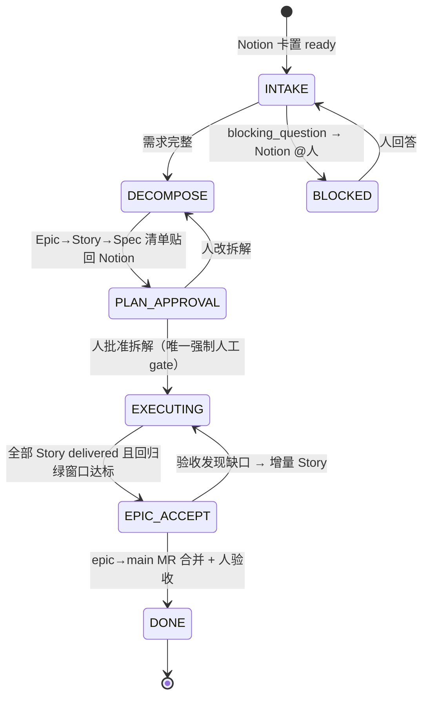
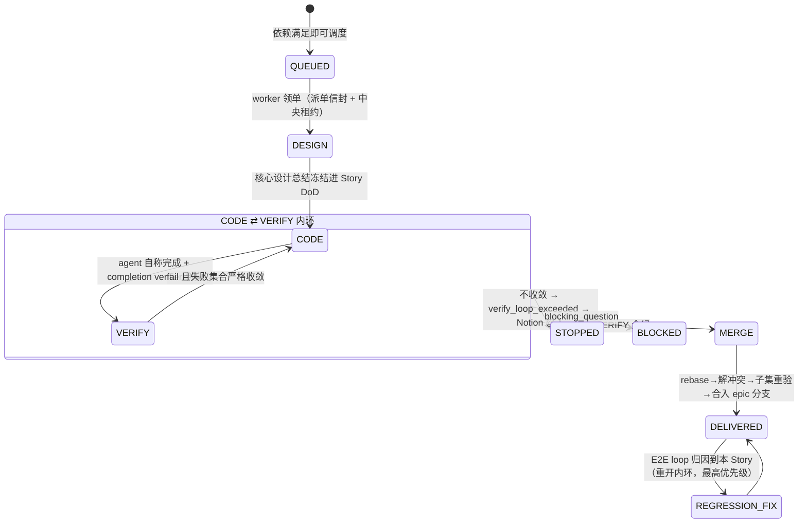
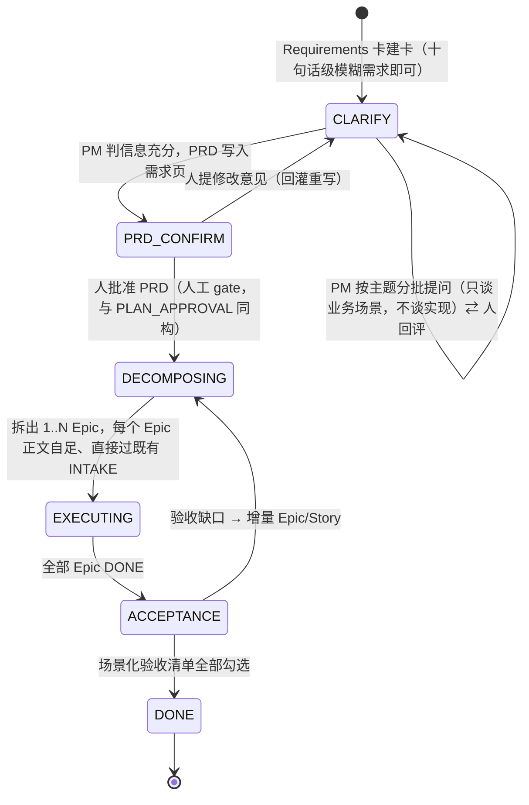

# 需求流水线与质量闭环设计

## 0. 设计原则（教训 → 硬约束映射）

| # | 教训来源 | 落成的设计约束 |
|---|---|---|
| 1 | busybee 旧验证阶梯硬编码 Maven 导致前端卡死循环 | 验证阶梯只定义**证据形态与裁决规则**，不定义命令；执行命令由 agent 现场决定，verdict 由代码从轨迹核验 |
| 2 | busybee 验证造假事故（file:// 假页面截图冒充 e2e） | 所有 agent 自报结论通道 = L2 物理掐断 + L3 代码校验双层；VERIFY/E2E runner 工具面禁写 |
| 3 | cumora builder/verifier 分离（DB CHECK 三层强制） | `VERIFY.session_id != CODE.session_id` DB CHECK；VERIFY 永远 fresh session 盲审 |
| 4 | cumora completion verifier | 每个 phase 出口一次独立小脑调用看 side effects，fail-closed |
| 5 | busybee 基线红绿（D7） | TDD 红证据从执行轨迹挖，挖不到 → skipped 升级 reviewer，不信自报 |
| 6 | cumora 失败物化 | regression 卡唯一索引去重；friction 计数器；24h 否决 ≥3 → 改进提案 |
| 7 | busybee "人为上限只伤真实工作" | 只兜 CODE⇄VERIFY 收敛性；真停点仅 blocking_question / verify_loop_exceeded |
| 8 | busybee memory 断流（D23） | 进料通道全部带流速指标 + 断流告警；调查报告/逐场景 verdict 强制入 memory |
| 9 | cumora 行为回归方法论 | 系统自测用样本级统计，不 gate PR |

## 1. 流水线 DAG

### 1.1 两层状态机

**Epic 级**（orchestrator 确定性状态机，权威真相在中央 DB，Notion 是投影）：



**Story 级**（EXECUTING 内部，每 Story 一个实例，多 worker 并行）：



**全局拓扑（含常驻 E2E loop）**：

```
                        ┌────────────────────────────────────────────┐
 Notion ──intake──► DECOMPOSE ──► [Story A]──┐                       │
   ▲                    │         [Story B]──┼─► MERGE ─► epic/<id> 集成分支
   │(每轮业务语言报告)   │         [Story C]──┘  (rebase+子集重验)    │ HEAD
   │                    │  依赖声明+footprint 决定并行/串行           ▼
   │              scenario 注册表 ◄──owner_story──┐   ┌─────────────────────┐
   │                                              └───┤ 常驻 E2E 回归 loop    │
   └── regression 卡(去重物化) ◄──统计判定+归因────────┤ 事件触发 + LRU 轮询    │
                                                      └─────────────────────┘
```

### 1.2 Story 并行判定：显式依赖声明为主、模块级 footprint 为辅的保守调度

DECOMPOSE 为每个 Story 产出：

- `depends_on: [storyId]`——语义依赖（B 要调 A 的接口），捕获"物理不冲突但逻辑有序"；
- `predicted_footprint: [模块/目录路径]`——**刻意目录/模块粒度，不用文件粒度**（agent 文件级预测实测不准，目录级足够保守可校准）。

调度规则（纯函数，可单测）：拓扑序内 footprint 两两不相交 → 并行分派；相交 → 串行链。另维护 **hotspot 文件清单**（路由表/i18n/schema 等历史冲突高发文件，资产化累积）——命中即强制串行。双信号取并集最安全，代价只是并行度略降——**正确性优先于吞吐**。

校准闭环：Story 合入后用实际 diff 回写 actual_footprint，预测偏差率进 memory 作为 DECOMPOSE 质量指标（进料通道带流速观测）。残余风险："不相交"的 Story 仍可能语义冲突——由合流后子集重验 + E2E loop 兜底。

### 1.3 分支与合流：epic 集成分支 + Story 分支逐个合入 + Epic 单 MR

- `epic/<id>` 从 main cut，是 Epic 的集成基准；每 Story 独立 worktree + `story/<epic>-<id>` 分支；**依赖 Story 在被依赖者合入后才 cut 分支**（天然拿到依赖代码，无需 cherry-pick）。
- 合流：rebase onto epic HEAD → 有冲突 CODE agent 现场解 → **推 Story 分支并开 draft MR（story→epic）** → **子集重验**（本 Story 场景 + footprint 相交 Story 的场景）→ ff 合入 → 推 epic 分支。MR 必须在合入之前开：合入之后 epic 分支已含全部 commit，平台会以「无差异」拒绝；复验失败退回 CODE 后再来，复用已开的 MR，不开第二个；目标分支已包含该分支时不开 MR 并写明原因（2026-09-10）。
- epic 分支由系统在拆解批准时推到 origin，派发前重试，每次合入后推头；Story 分支 stack 在它上面，所以它不能只活在本机（2026-09-10）。
- MR：Epic 级单 MR（epic→main），commit 按 Story 分段（保留 red/green），文案按 Story 分章；单 Story 小 Epic 退化为 story→main 直出。
- 理由：常驻 E2E loop 需要"当前 Epic 全量交付态"的分支作回归基准；人审拿到完整业务上下文；redo 语义清晰（每轮全新分支+新 MR 防 stale ref，busybee D6）。
- 缓解：epic 分支每日 merge main 防偏离（回归 loop 验证吸收成本）；>8 Story 的 Epic 提示"建议拆 Epic"由人裁决；人审主阵地是 Notion（每 Story 有设计总结+逐场景报告），MR 只是代码载体。

### 1.4 常驻 E2E 回归 loop：双池、非 gate、样本级判定

| 维度 | 设计 |
|---|---|
| 形态 | orchestrator 内 RegressionScheduler（确定性排程）+ 浏览器 worker 上的 regression runner（agent 会话，只读工具面） |
| 双池 | 活跃 epic 场景清单 → `epic/<id>` HEAD；已进 main 历史场景全集 → main HEAD（低频池） |
| 触发 | 事件：每次 Story 合入后该 epic 全量场景排一轮；空闲：LRU 轮询——最久未验证场景优先，永不停，让位前台任务 |
| 判定 | **样本级统计**：单次失败只标 suspect 并连排 N 次复测；窗口失败率超阈值才立卡（天然吸收 flaky） |
| 归因 | 场景注册表每条挂 owner_story；owner 已交付而失败出现在新合入之后 → 对**单个场景**在合入 commit 序列上二分 → 定位引入 Story |
| 物化 | regression 卡，唯一索引 `(scenario_id, failure_signature)` 去重 → 路由到归因 Story 的 REGRESSION_FIX，队列最高优先级 |
| 防伪 | runner 禁写代码（只能运行测试/驱动浏览器）；L2 拦 file:// 与非白名单 host；L3 verdict 校验 URL host 白名单 + 截图真实存在且 mtime 在本轮窗口 + 测试结果从执行轨迹取非自报 |

**VERIFY 与 E2E loop 职责边界**：

| | Story VERIFY（内环） | 常驻 E2E loop |
|---|---|---|
| 性质 | 出厂检验，**同步 gate** | 持续回归，**异步非 gate** |
| 范围 | 本 Story 场景 + 邻接受影响场景 | 全部已交付场景 |
| 失败后果 | 打回 CODE（收敛判据兜底） | 物化 regression 卡入队，不打断进行中内环 |
| 判据 | 单轮决定性 | 样本级统计 |

### 1.5 内环收敛判据 + 可配置重试上限族（2026-08-25 修订）

两层兜底，先到先停：

1. **收敛判据（提前停）**：`failed_scenarios(N) ⊊ failed_scenarios(N-1)`（严格真子集）→ 放行续跑；持平、扩大或震荡 → 立即 `verify_loop_exceeded`，不用等上限。
2. **可配置硬上限族（最终停）**——全部经 Web 控制台动态配置（05 文档 §4），默认值刻意宽松：

| 键 | 语义 | 默认 |
|---|---|---|
| maxInnerLoopRounds | CODE⇄VERIFY 内环总轮次 | 6 |
| maxPhaseReentries | 单 phase 重入次数（failover/崩溃恢复/跨机重建合并计数） | 3 |
| maxContinueRetries | 断线 continue 重试 | 8 |
| maxRegressionReopens | 同一 Story 被 E2E loop 打回 REGRESSION_FIX 的次数 | 2 |

**上限设在"离散重试轮次"，不设在单次运行的时长/token/预算上**——与 busybee 教训一致（后者只伤害真实工作，前者才是"系统在原地打转"的信号；busybee 自己也保留了 MAX_TEST_ITERS）。

**这一条约束的是"打转探测"，不是"花钱敞口"（2026-09-10 增补）。** 两者是不同的控制，互为劣质代理：轮次答的是"系统是否在原地打转"，预算答不了；费用答的是"一张卡最多可以花多少钱才该有人看一眼"，轮次同样答不了——同样 6 轮内环，在 1M 上下文模型上的花费能差一个数量级。所以新增第三层，与上两层职责分离、先到先停：

3. **单卡费用上限（花钱敞口）**：`cost.perCardUsdCeiling`（默认 5 USD，约 35 元；单位是 USD 因为 pi 就按 USD 报价）。在 **phase 边界**检查——一次 turn 无法中途掐断，且"即将开始那一轮花多少"在它结束前不可知，所以上限是**超支的下界，不是精确切口**：卡是"越线之后停"，不是"越线之前停"。**订阅额度不计入**：包月计划无论卡用不用都是同一笔钱，把 pi 给订阅算的名义价折进去，会为一笔没发生的支出提前停牌一张卡。

到达费用上限的处置与上限族不同：**不出诊断报告，也不进反思管道**。费用停点对"这活能不能干成"零信息量，报告只说花了多少、花在哪个 phase、以及"这是花钱上限不是对工作的判决，抬上限继续或把卡拆小"。混淆这两件事会让读卡的人去查一个不存在的需求缺陷。

**到达上限的处置**：卡置失败 + Notion @创建人 + **诊断报告**（中脑基于收敛曲线、失败集合演化、轮次证据生成业务语言说明），按两分法给出结论与建议：

- **需求侧**：需求太难或拆解粒度不合理 → 建议人工拆卡、补充上下文或调整 Spec；
- **系统侧**：中间流程/逻辑存在缺陷（如验证契约歧义、prompt 误导、调度错误）→ 自动物化 friction 进反思提案管道（§4），累积后产出流程优化提案。

全系统真停点因此为四类：`blocking_question`、`verify_loop_exceeded`（不收敛提前停）、`retry_limit_exceeded`（上限停 + 诊断）、`cost_ceiling_exceeded`（费用停，无诊断）。四者由 `stories.stop_reason` 的 CHECK 强制。（"每轮修一个"拖长的钻空子风险：收敛曲线附在 Notion 卡供人随时叫停 + 上限族最终兜底。）

## 2. TDD 执行契约

### 2.1 Spec → 测试映射

DoD 每条业务场景带全局唯一 `scenario_id`（如 S-EPIC12-03）；测试代码内嵌标记（测试名前缀或注解 `@scenario S-EPIC12-03`）。**映射完整性由 L3 代码扫描核对**（扫测试文件收集标记 vs DoD 清单 diff），不信 agent 自报——缺口 → VERIFY 直接 fail 并列出未覆盖场景。

### 2.2 五层测试裁剪决策规则

DESIGN 阶段产出**测试矩阵声明**冻结进 Story DoD；VERIFY 按声明核对；豁免走 exempt + 理由留痕。

**层有归属，且由系统固定而非 DoD 声明（2026-09-10）**：unit / integration / snapshot 归 CODE，用测试证明；e2e / ui 归 VERIFY，在真实浏览器里证明。CODE 是 TDD 驱动、要快，不买慢的浏览器轮；VERIFY 不采信 CODE 对屏幕的自述。CODE 出口只查 CODE 归属层的红绿证据；VERIFY 对每个 e2e / ui 场景要求**属于该场景独有的截图 + 到达的页面**，由 verdict 代码校验——S-E3OVERVIEW-01 曾用同一张截图通过四个场景。缺失记 `inconclusive`（§9.3），不进 failed 集合。

| 层 | 触发条件（按改动性质） | 证据形态 |
|---|---|---|
| 单测 | 永远（任何逻辑变更的底线层） | 轨迹中 test 工具事件：红输出 hash → 绿输出 |
| 集成 | 跨模块边界 / DB / 外部 IO / 消息 | 同上 + 真实依赖启动日志（禁 mock 冒充） |
| snapshot | API 响应形状 / 序列化输出 / 组件渲染树 | snapshot diff 文件落盘进 evidence |
| e2e | DoD 场景含用户可见行为流（业务场景基本都要） | 白名单 host 页面轨迹 + 截图（L3 校验真实性） |
| UI 测试 | 视觉/交互组件改动 | 截图对比 + 交互录制，进 evidence 目录 |

### 2.3 红绿证据链

CODE micro-cycle：按 scenario 逐条 `写测试 → 跑红 → 实现 → 转绿 → commit`，约定 `test(S-xx): red` / `feat(S-xx): green`——红绿在 **git 历史与执行轨迹双通道**可审计。verdict 代码从轨迹挖红证据（test 工具事件的失败名单）；挖不到红 → 该项 skipped 升级给盲审 reviewer（其 prompt 被要求专门审基线）。**验证命令永不硬编码**：契约只规定"必须留下红/绿的轨迹事件"，跑什么命令 agent 看现场决定。

## 3. 角色与模型分配表

档位映射见 02-distributed-execution §5（day1：大脑/中脑=Codex，小脑=GLM/Grok；预留 Claude 列 opus/sonnet/haiku）。

| 角色 | 职责边界 | 档位 | 升级条件 | 工具面 |
|---|---|---|---|---|
| 需求分析/拆解（DECOMPOSE） | Epic→Story→Spec 清单、依赖声明、footprint 预测 | **大脑** | —（拆解质量决定全局，恒大脑） | 读代码+读 Notion；无写 |
| Story 设计总结（DESIGN） | 核心设计一页纸 + 测试矩阵声明 | 中脑 | footprint 跨 ≥3 模块或 complexity=high → 大脑 | 读代码；无写 |
| 编码（CODE） | TDD micro-cycle、解合流冲突 | 中脑 | 内环第 2 次重启 → 大脑（最多升一次，再挂走 ops_alert） | 读写 worktree+测试+git（不可 push main） |
| 盲审验收（VERIFY） | fresh session 盲审、逐场景 verdict | 中脑 | inconclusive 或基线争议 → 大脑 | **只读**+测试+浏览器（L2 掐 file://、禁写） |
| UI 验收走查（VERIFY 内独立道） | 产品经理视角逐场景验收界面 + 出界面 findings（不否决） | **大脑** | —（判"是否是当初要的东西"，恒大脑；需目录宣告图片输入） | **只读**+浏览器+截图作图片输入；无写 |
| completion verifier | 看 side effects 判 done 真伪，fail-closed | 小脑 | 永不升级（保持廉价快速） | 只读轨迹/diff，单次调用 |
| E2E 回归 runner | 执行场景、采证 | 中脑 | — | 只读+浏览器+测试；禁写代码 |
| 回归归因分析 | 失败签名、二分定位 | 中脑 | 归因矛盾/多 Story 疑凶 → 大脑 | 只读+git log/bisect |
| MR 文案 | 按 Story 分章的 MR 描述 | 小脑 | — | 只读 diff+DoD |
| 反馈 triage | Notion 评论分类路由 | 小脑 | — | 读 Notion+写路由决定（结构化输出） |
| 反思提案生成 | friction 累积 → prompt/规则/契约改进提案 | **大脑** | —（改系统自身规则是最高风险决策） | 只读 memory/轨迹；提案只落 Notion 待批 |
| memory distiller | 终局蒸馏 episode→lesson | 小脑 | — | 只读轨迹；写 memory 库 |

硬约束（代码级非 prompt 级）：`VERIFY.session_id != CODE.session_id` DB CHECK；VERIFY/E2E 工具面在 hook 层物理禁写与禁 file://。

## 4. 人类反馈闭环

```
Notion 评论/打回/needs_input 回答
        │ （反馈事件抢占调度队列头——人的输入是最高优先级）
        ▼
   triage（小脑，结构化四分类）
        ├─ requirement_change ─► 该 Story continue round（复用分支）或 DECOMPOSE 增量出新 Story
        ├─ defect ────────────► regression 卡（同一去重索引体系）
        ├─ process_feedback ──► friction 记录累加 ─► memory lesson candidate
        └─ answer ────────────► 解锁对应 BLOCKED 卡，回注同一上下文继续
```

**反思机制**：触发条件（任一）——同一角色 24h 被否 ≥3 次；同类 friction 累计 ≥N；行为回归统计显著劣化；`retry_limit_exceeded` 诊断判为系统侧（§1.5）。触发后大脑生成**改进提案卡**（内容是具体 diff：prompt 措辞 / 调度规则参数 / 验证契约条款），贴 Notion 待人批准（可见性与讨论）。**批准后不直接改文件**：prompt 类提案自动生成 Prompt 工作台的 draft 版本，走"灰度 → 行为回归对比 → 发布/回滚"流程（05 文档 §6）；配置类提案落 config draft（05 文档 §4）。**提案永远不自动生效，人批是唯一开关**。所有 triage 结果与提案采纳率带流速指标防断流。

## 5. 交付定义（DoD）契约

**Story DoD**（DESIGN 出口冻结，后续不漂移的 setpoint）：

```yaml
story_id: S-EPIC12-03
design_summary: <一页纸核心设计，业务语言>
scenarios:
  - id: S-EPIC12-03-a
    given/when/then: <业务语言；then 点名可观察物与边界>
    layers: [unit, e2e]          # 测试矩阵声明（§2.2 裁剪结果；层归属由系统固定）
    source: <含 e2e/ui 层时必填：数据从哪张表、哪类事件、哪个既有接口来>
    seed: <可选：given 在屏幕上需要的样例数据，人话一句；走查前经仓库的 verify.seedCommand 造出>
    examples:                    # 含 e2e/ui 层时必填：至少一条 shows 与一条 excludes
      - kind: shows
        text: <用户看到的字面文本>
      - kind: excludes
        text: <不得出现的内容>
baseline: acceptance_test | bug_repro | exempt(reason)
acceptance_criteria:             # 每条必须有归宿
  - text: <人可勾选的验收条目>
    scenarios: [S-EPIC12-03-a]   # 由这些场景的测试证明
  - text: <约束型条目>
    constraint: <由什么代码检查兜底>
out_of_scope: [<走查不得据以否决的事项；可为空但必须写>]
relies_on: [<依赖其正常工作的既有页面/路由/服务；它们坏了不算本卡失败>]
predicted_footprint: [module/dir]
depends_on: [story_id]
```

**DoD 写到什么程度（2026-09-10）**：只读代码的 CODE 与只看屏幕的走查，对着同一条 `then` 必须得出同一个结论。「简洁」「清晰」「摘要」这类词必须由 `examples` 的字面样例定义；schema（`src/pipeline/dod.ts`）在 DESIGN 出口强制上述字段，含糊的 DoD 出不了 DESIGN。依据：S-E3OVERVIEW-01 八轮中两轮（第 6、7 轮）源于 `then` 只写「简洁活动摘要」，CODE 按最小解释做、走查按用户语义打回，两边都没错，错在 DoD 允许两种解释；另有三条验收标准无任何场景归宿，只能靠评审人眼发现。

**Epic 完成判定**（可代码判定，非 agent 自报）：全部 Story delivered ∧ epic 回归池连续 K 轮全绿（或 24h 无新增 regression 卡）∧ MR 合并 ∧ Notion 人工验收勾选。

**业务语言硬约束**：Notion 报告分两区——业务区（场景名 + 状态 + 一句人话结论）与折叠的 technical notes 区（命令/路径/栈）。**L3 lint 代码校验业务区**：出现代码块、文件路径、异常栈的 regex 命中即打回重写——可读性约束也不靠 prompt 自觉。

## 6. 系统自身的质量保障

| 层 | 对象 | 方法 |
|---|---|---|
| 单测 | 全部纯函数决策逻辑：收敛判据、footprint 相交判定、拓扑调度、triage 路由映射、regression 去重键、verdict→phase 映射、业务语言 lint | 常规单测，逻辑与 IO 分离（沿用 busybee parse/decision 纯函数模式） |
| 契约测试 | Notion client、PiRunner port | 罐头回放 adapter（busybee finalText 回放模式）；DoD schema 校验测试 |
| 行为回归 | prompt/规则变更后的 agent 行为 | **样本级统计**：每关键行为 N trials，比较通过率置信区间，nightly 报表，**不 gate PR**；prompt 改动前后 A/B 对照 |
| 闭环观测 | 防静默断流 | 指标见 04-observability §9.3；任一归零超窗即告警 |

## 7. 增补（2026-09-01）：需求层（产品经理）状态机与场景化验收

> 决策见 00-overview §2「产品经理层」；Notion 侧信息架构见 01 §8。在 §1.1 的 Epic 级之上增加 Requirement 级状态机；PM 是新角色（大脑档），是用户唯一的业务对话面。

### 7.1 Requirement 级状态机



### 7.2 原则（继承既有不变量，不新增例外）

- **不新增真停点类别**：澄清等待人回答复用 blocking_question 语义（needs_input 呈现）；PRD 确认与验收勾选是状态机人工 gate（同 PLAN_APPROVAL），不是停点。澄清轮次上限 config 化，超限 → blocking_question @人。
- **业务语言约束扩展**：PM 的提问与 PRD 全文适用业务语言 lint（不得含实现词汇）。用户在需求层只谈方向与场景；实现细节问题只允许在 Story 层以 blocking_question 出现且应少量。
- **字段所有权不变**：原始需求区段人 owner；澄清记录/PRD/验收清单系统 owner，人的勾选与评论作为输入被 ingest——同一字段仍永不双向合并。
- **验收关注行为不关注代码**：验收清单逐条对应 PRD 场景（业务语言）；代码质量由既有自动化（盲审/completion verifier/回归 loop）+ 定期优化单（tasks.md M4-18）管控，不进入人的验收面。
- **Epic 完成判定的归属（2026-09-02 补记）**：§1.1 的 `EPIC_ACCEPT → DONE : MR 合并 + 人验收` 中，「人验收」对隶属需求的 Epic 上移到需求层——MR 合并（`EpicCompletion` 经平台 CLI 读回 merged 状态，代码判定）即 DONE，人的验收只在需求页按场景勾选做一次；独立 Epic（无 requirement）仍需人在看板拖到「已完成」+ MR 合并两者齐备。此前无任何代码执行该迁移，需求永远到不了 ACCEPTANCE。

### 7.3 角色与模型分配表扩展（§3 增补行）

| 角色 | 档位 | 说明 |
|---|---|---|
| PM（澄清/PRD/需求拆解/验收清单生成） | 大脑 | 面向用户的唯一业务对话面；prompt 独立于开发线（prompts/pm/），经 resolveModel 取模型 |

## 8. 增补（2026-09-09）：主流程收敛——内环只保留一个 LLM 判定

依据 2026-09-05 首次 Epic→Story 实跑的数据（三张 Story、约 45 条 phase.failed，其中供应商类约 31 条，无一交付）与 `docs/design/diagrams/story-main-flow-as-built.html` 的断点分析。核心结论：一轮内环串着 CODE agent、CODE completion judge、VERIFY agent、MERGE agent、MERGE completion judge 五个 fail-closed 的 LLM 判定，合流再加一个盲审；每个否决都按"代码有问题"计入预算，供应商故障再吃一次预算。这是"小任务跑不完"的结构性原因，不是某个 bug。

### 8.1 CODE 出口改为确定性检查，撤销 completion judge

§0 第 4 条引入 completion judge 的目的是抓"自称完成但没做"。它要抓的三种形态全部有确定性替代，且 §2.1 / §2.3 早已把原料定义成了契约：

| 假完成形态 | 代码检查（CODE 出口，fail-closed） |
|---|---|
| 树脏、没提交 | `git status --porcelain` 为空；`main..HEAD` 有提交 |
| 红绿没跑 | 规范日志里每个 scenario_id 至少一次失败的 test 事件后接一次成功的 test 事件（§2.3 双通道之一） |
| 场景没测 | 扫测试文件收集 `@scenario` 标记与 DoD diff（§2.1，此前未实现） |
| 不可合并 | format / lint / typecheck / 全量测试通过；`git diff --check` 干净 |

不过检查项**不计任何预算、不产生停点**，清单原样喂回 CODE 继续。确定性覆盖不到的只剩"实现是否真的满足需求"，那是 VERIFY 的职责；CODE judge 与 VERIFY 重叠，撤销。MERGE 的 completion judge 同样撤销：它要确认的"没越权合并、报告存在"分别由工具面掐断与 artifact 存在性检查覆盖。

### 8.2 MERGE 只写报告，没有否决权

MERGE 阶段保留为"写业务语言交付报告"，报告质量由 §5 的业务区 regex lint 校验。MERGE 不再跑任何门禁；门禁全部前移到 8.1 的 CODE 出口，并在合流时由系统再跑一次。此前 `git diff --check` 是 agent 在只读阶段自选执行、失败后无处修复，导致六次原地停点。

### 8.3 合流复验改为确定性测试，浏览器盲审归回归 loop

§1.3 子集复验的目的是抓"单独对、叠在一起错"。实跑证实这是真需求（三个 Epic 的 Story 都改同一页面与路由表），但 §1.4 的常驻回归 loop 本就负责这件事。修订：rebase 到 Epic 头后，只运行本 Story 与 footprint 相交 Story 在 CODE 阶段写下的全部测试（含 e2e 脚本），通过即 ff-merge；浏览器盲审只在 Story 首轮 VERIFY 做一次，合入后由回归 loop 异步扫，失败开 regression 卡而不是把 Story 打回 CODE。合流从 gate 变成确定性步骤，成本接近零。

### 8.4 供应商故障不进任何预算

usage limit、限流、超时、传输中断、OAuth 刷新失败只进熔断器：卡原地等待，不计内环、不计重入、不产生停点。三类真停点不变，但只由代码层面的失败触发。CODE 的 prompt 超时改为 checkpoint 续跑，续跑耗尽才算一次失败。熔断探测使用不计费的凭据探针，不再以真派单探测；用量窗口解析不到时指数退避。Notion 上区分"等待供应商"与"需要输入"。OAuth 刷新单点化：多 pi 进程共享一份凭据并发刷新会互相作废旋转令牌。

### 8.5 Story 是垂直切片，每张 Story 有自己的 draft MR

对齐 INVEST：Story 必须 Independent 与 Testable，是切穿全部层、有用户可见入口、可独立验证的垂直切片；Epic 只是分组。DECOMPOSE 增加约束：每张 Story 必须声明用户可见入口与独立验证路径，Epic 内 Story 数上限 config 化（默认 4），超限或出现水平切分（同一页面的验收条目被拆成多张卡）即打回重拆。交付：Story DELIVERED 时开 story→epic 的 draft MR（stacked PR），链接回写 Notion；Epic 完成时开 epic→main 的最终 MR。§1.3 "Epic 级单 MR"修订为"Epic MR 是最终合并入口，Story MR 是人可见的交付单元"。

### 8.6 收敛判据只看代码层失败

`failed(N) ⊊ failed(N-1)` 的输入必须只含场景级失败。盲审因环境原因（服务未起、端口占用、截图落点错误）给出的 fail 记为 `inconclusive`，不进入 failed 集合，也不消耗轮次；连续两次 inconclusive 才作为系统侧 friction 物化。

## 9. 增补（2026-09-10）：UI 验收走查独立成道

盲审（§8）判的是"测试是否证明了这件事做成了"。它读不出"用户打开这一页看到的东西对不对、好不好看"——测试全绿而界面错位、文案不对、状态缺失，是同一轮里两个完全不同的问题。因此在 VERIFY 内增加一条**独立的 UI 验收道**：另一个 session、另一副眼睛，把截图当图片读进去，必要时自己开浏览器点，站在当初提需求的人的位置上验收。

### 9.1 两个判定拆开，只有功能能否决

一次走查返回两组结论,它们不是同一个问题:

| 结论 | 内容 | 能否决? | 进 failed 集合? |
|---|---|---|---|
| `acceptance`(逐 scenario) | 要的东西在不在、进不进得去、做的是不是那件事 | **能** | 进(缺按钮是代码层失败) |
| `findings` | 间距对齐、视觉一致性、文案、空/错状态、布局是否站得住 | **不能** | 不进,也不消耗轮次 |

审美不能否决,是结构性决定而不是宽容:`failed(N) ⊊ failed(N-1)` 在品味上不成立——给了否决权的评审每轮会挑出不同的一处细节,这正是 §8 通过把内环收敛成单一判定所消除的那个失效模式。所以 `severity` **没有 blocking 档**:没有地方可去。findings 交给人,由人决定哪一条值得单独开卡。

### 9.2 三条边界

- **只在功能道已经 accepted 的轮次跑**。已经要打回 CODE 的一轮不需要第二个意见,花一个大脑档多模态 turn 去确认一个已知失败是纯浪费。
- **只看 `ui` / `e2e` 层的 scenario**。没有界面的 scenario 没有可看的东西。
- **原型图是参考不是判据**。原型画在实现之前,不要求像素级一致,与它的差异最多是一条 finding;只有需求用文字写明"必须与原型一致",差异才算功能验收不通过。

### 9.2a 否决必须回指 DoD（2026-09-10）

走查每条 `failed` 必须带 `cites`：所违反的 scenario `then` 或 `examples` 原句，代码校验引用真存在于 DoD（`splitRefusals`）。引不到的观察**不否决**：记为 finding，同时作为「DoD 修订建议」写到 Notion 卡上，由人批准后成为下一轮 `[answer:]` 任务。理由与 9.1 同源：一个可以凭任何用户语义否决的评审，就是一个每轮加需求、无上限的产品经理，`failed(N) ⊊ failed(N-1)` 对它不成立。DoD 的 `out_of_scope` 与 `relies_on` 随 prompt 下发：前者不得据以否决，后者坏了记 `inconclusive` 并点名依赖而非本卡。

### 9.3 跑不起来不占预算

走查自身失败(浏览器起不来、回复不是要求的 JSON)记 `inconclusive`:卡照常交付,按 §8.6 不进 failed 集合、不消耗轮次,但作为系统侧 friction 物化——它是我们的缺陷,不是这张卡的。同理,目录里没有宣告图片输入的模型不会被派去看界面:那是演戏,该道直接跳过并明说。

### 9.4 两条不做的决定（2026-09-10）

- **余额不做预警,假设充足**。DeepSeek 没有余额查询 API,靠累计估算去猜只会得到一个不可信的数;真的耗尽时 API 自己会返回错误码,分类器已认得(QUOTA → 停牌叫人,充值只有人能做)。唯一有业务意义的护栏是**单任务消耗上限**(`cost.perCardUsdCeiling`,§1.5),它管的是"一张卡不能花过头",而不是"账户还剩多少"。
- **等人不做二次提醒**。停点首次告警之后不再重复推送,卡可以无限期停在等人。这是明确接受的:重复提醒的价值低于它带来的噪音,人什么时候回是人的节奏。

## 10. 增补（2026-09-10）：轮次为什么会烧掉——一张卡八轮的归因与可迭代性

依据 S-E3OVERVIEW-01 全部 8 轮（17 个 phase run，$4.73）的逐轮展开（`scripts/inspect-round.ts`）。归因：2 轮真 bug；1 轮门禁放错位置（尾随空白到 MERGE 才查）；3 轮含环境失败（评审打到旧服务、OAuth 401、评审自建服务 500）；2 轮 DoD 含糊（§5 修订）。此外第 7 轮 CODE 的 prompt 15.9KB，人的回答缺失、三段可执行内容全在最后 1KB；第 8 轮 21.1KB 中 18.6KB 是 6 份重复旧产物。结论：轮次不是被模型「偷懒」烧掉的，是被契约漏洞烧掉的，而工具不足让漏洞看不见。

### 10.1 prompt 结构：该做的事在前，历史在后，只注入最新产物

`assemblePhasePrompt` 在 `## Specification` 之后紧接 `## What this round must do`：每项带 tag——`[answer:<feedbackId>]`（人的回答）、`[rejected:<phase>]`（上一次被拒的原因）、`[scenario:<id>]`（仍失败的场景，附两条道各自的原因）。`## Evidence from earlier rounds` 与 `## Output of earlier phases` 排最后，且每个 (phase, kind) 只注入最新一份产物。纯函数与稳定排序不变，跨机重建仍逐字节相同。

### 10.2 CODE 出口增加「逐条回应」检查

CODE 的 artifact 必须为每个注入的 tag 写一行 `addressed <tag>: <what you changed>`；缺的 tag 作为 gate finding 喂回同一 session（不计轮次、不计重入，与 §8.1 其他检查同性质）。检查的是「有没有对它作出回应」，不是「回应对不对」——后者是 VERIFY 的事。

### 10.3 可观察与可重放

- `scripts/inspect-round.ts`：一轮一屏——prompt 分段体积与 tag 到达位置、工具调用统计、模型自述、该 run 窗口内的 commit、verdict 与两条道的逐场景原因；VERIFY 与走查的 session 按时间窗口从各自 lane 目录找到。
- `scripts/replay-phase.ts`：用某轮存下的输入单跑一个 phase，不写库、不动状态机、不发 Notion；改 prompt 后直接对比产物。
- 轮次账本：`round` 是永不重置的流水号；预算按 `last_human_action_at` 之后被拒的轮数计，Notion 显示 `Budget x/6`。

### 10.4 人的回答可见

Story 页「待人回答」区列出已应用的回答：谁、何时、针对哪条、原文，以及用于第几轮。运维代答按实际来源署名，不冒充看板上的人。

## 11. 增补（2026-09-10）：从需求到合入主分支的闭环审计

对着「requirement → 拆 Epic → 拆 Story → 开发/自测/审查 → draft MR 到 epic 分支 → 验收 → epic 分支合入 main」逐函数追踪，找到 10 处让链路无法闭环的缺口，一批修完。原则：每一处都是「流程在某个环节把责任丢给了人却没告诉人」，修法是让系统自己把事做完，做不完就把停点写到人能看到的地方。

- **MR 顺序**（§1.3）：MR 在 ff-merge 之后开，永远是空 diff。改为 rebase → 推分支 → 开 MR → 复验 → 合入。
- **Epic MR 不中止周期**：缺 red/green 提交名时不再抛错中止整个 orchestrator 周期，改为在 MR 描述里写「无红绿提交对，见验证报告」；目标分支来自 `--target-branch`；Epic MR 等 Epic 回归池没有未解决的回归卡才开；EPIC_ACCEPT 下 MR 被关闭未合并则退回 EXECUTING 重开。
- **走查环境**（§9）：仓库级 `verify.appStartCommand` / `verify.appReadyUrl` / `verify.seedCommand`，DoD 场景以 `seed` 声明样本数据；系统起服务、造数据、把 URL 交给评审。起不来记 friction、场景 inconclusive，不否决；走查 inconclusive 在 Notion 上可见，不再被功能道结论吞掉。
- **需求层停点**：`clearStop` 有了调用者——人的回答清掉 stop 并进入下一轮澄清；需求页渲染停点详情与回答方式，而不是一个枚举词。HUMAN_PARKED 且无 resume_state 不再抛错。EXECUTING 期间 Epic 进度变化重新投影需求页。
- **MERGE 可重入**：MERGE 阶段失败与 DESIGN/CODE 同样在预算内自动重入；平台瞬时错误不是停牌理由。
- **重置解冻**：人把 Story 拖回 DESIGN，或冻结 DoD 不再满足当前契约，系统解冻 specs、作废 DESIGN/MERGE 第 1 轮与未验证的 CODE 轮，自动回 DESIGN；不再靠幂等复用把旧结果递回来。
- **停牌上浮**：任一 Story NEEDS_INPUT，Epic 转 BLOCKED 并在 Epic 页写明哪张卡停在什么原因；全部恢复后自动回 EXECUTING。这种 BLOCKED 不能被评论「回答」成重新拆解。
- **回归环路接通**：sweep 传 probe worktree，归因能跑；`regression_cards` 有 resolve 语义；REGRESSION_FIX 是可运行的 phase（见 tasks IT-2x）。
- **outbox 死信**：每行计 attempts，超过上限转 dead 并保留错误；周期日志报 failed/dead 计数，`inspect` 可列死信。

